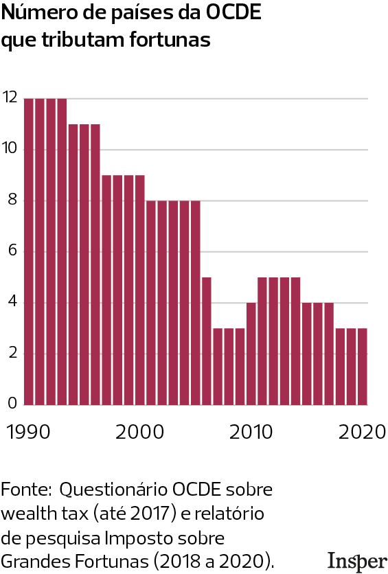

## Introdução

Imagine um imposto aprovado na Constituição há mais de 35 anos, com nome, sobrenome e artigo próprio, mas que nunca foi cobrado de ninguém. É esse o IGF, o único tributo que o Brasil nunca aplicou. Previsto desde 1988, ele depende de lei complementar para entrar em vigor. Desde então, mais de uma dezena de projetos tramitaram no Congresso sem chegar a lugar nenhum. O imposto virou símbolo de um debate que vai muito além da técnica: ele mexe com questões de justiça social, eficiência econômica e o papel redistributivo do Estado.

O ponto de partida para entender essa discussão é o próprio sistema tributário brasileiro. Pesquisas apontam para uma tendência regressiva: a arrecadação é concentrada em tributos sobre o consumo, e a conta de luz, o transporte e os alimentos pesam proporcionalmente mais no bolso de quem ganha menos (DE CASTRO FERREIRA, 2015). Dados mais recentes reforçam esse diagnóstico: um estudo de 2025 produzido com dados da Receita Federal identificou que os milionários no Brasil pagam alíquotas efetivas muito menores que o restante da população: **20,6% contra 42,5%** para o brasileiro médio, considerando todos os tributos (ZUCMAN et al., 2025).

::: caixinha-lateral-esq
"Tá, mas e a Economia? - Sistema Regressivo vs. Progressivo

Regressivo é quando a carga fiscal pesa mais sobre quem ganha menos. Progressivo é o oposto: quem tem mais renda ou patrimônio paga alíquotas maiores, como no Imposto de Renda. O IGF seria um instrumento de progressividade, mas aplicado ao estoque de riqueza acumulada, não ao fluxo de renda anual.
:::

O IGF entraria justamente para tentar inverter essa lógica: ao taxar o patrimônio de quem está no topo, os recursos seriam redistribuídos via políticas públicas. Mas tributar grandes fortunas é mais fácil na teoria, e os dois lados do debate têm argumentos sólidos o suficiente para justificar décadas de impasse.

## Argumentos a Favor

Os defensores da criação desse tributo argumentam que o cenário tributário atual apresenta uma distorção econômica, que está em um conceito chamado Propensão Marginal a Consumir (PMC). Famílias que possuem uma renda mais baixa, acabam tendo que gastar uma porcentagem maior dela em itens básicos, como alimentos, produtos de limpeza e de higiene pessoal, o que explica terem uma PMC mais elevada. Já indivíduos pertencentes a uma faixa de renda mais elevada, possuem uma PMC mais baixa, já que como suas necessidades básicas já estão amplamente supridas, a maior parte de sua renda não é gasta no comércio, mas sim direcionada para a acumulação e o crescimento de seu patrimônio. Essa disparidade comportamental não é apenas teórica, mas mensurada empiricamente por centros de pesquisa de excelência no Brasil, como FGV e USP, que mapeiam que a PMC dos 20% mais pobres no país oscila entre 0,80 e 0,92. Em contrapartida, investigações sobre a relação renda/consumo no topo da pirâmide demonstram que, para a população que está nos 1% mais ricos, a PMC está na faixa de 0,25 a 0,35, evidenciando que a maior parte de qualquer incremento financeiro flui diretamente para fundos de investimento e acumulação de capital rentista, deixando de tocar a demanda agregada da economia real.

::: caixinha-lateral-dir
"Tá, mas e a Economia? - Pensando na margem

Um economista sempre pensa na margem, ou seja, comparam custos e benefícios de uma unidade adicional, sem necessariamente olhar para o valor total ou para a média. Nesse caso, a PMC indica que se a renda aumentar R\$ 1 (essa será a margem), qual a porcentagem desse aumento o indivíduo gasta em consumo.
:::

Os defensores da justiça distributiva argumentam que ao tributar uma pequena parcela desse estoque de riqueza acumulada no topo, por meio do Estado, esses recursos seriam devolvidos à sociedade, e devido a PMC maior das pessoas com menores rendas, choques positivos de renda na base (como o ganho real do salário mínimo ou transferências de renda, como o Bolsa Família) são quase integralmente e imediatamente convertidos em demanda por bens de consumo de primeira necessidade, o que permitiria que sua PMC diminuísse, já que com mais renda, uma parte maior sobraria depois do consumo básico.

Outro argumento dos defensores é que essa taxação atua na redução da desigualdade estrutural de longo prazo, combatendo um fenômeno em que a taxa de rendimento do capital (o lucro que vem de investimentos financeiros, ações e imóveis) é maior que o crescimento da economia real (o avanço do PIB e dos salários). Quando isso ocorre, a riqueza de quem já é rico cresce muito mais rápido do que a renda de quem depende apenas do próprio trabalho, o que aumenta a desigualdade. Ao taxar o estoque de patrimônio anualmente, o imposto funciona como um freio na velocidade com que os juros compostos inflam as grandes fortunas, o que reduziria o ganho líquido dos ativos rentistas e, simultaneamente, transfere esses recursos para o financiamento de políticas públicas na base da sociedade.

## Argumentos Contra

Se os argumentos a favor partem de princípios de justiça, os contrários partem de um lugar mais pragmático: o imposto, na prática, pode gerar mais distorção do que benefício. Os críticos organizam essa objeção em três problemas econômicos distintos.

**Fuga de capitais:** Capital é móvel, e quando um imposto encarece demais, ele vai embora, junto com o domicílio fiscal do contribuinte. O problema não é só perder a arrecadação do IGF: perde-se também o IR, os impostos sobre consumo e o capital produtivo que deixa de ser investido localmente. O imposto pode acabar reduzindo a base tributária total, o oposto do objetivo.

::: caixinha-lateral-esq
"Tá, mas e a Economia? - Elisão Fiscal

Diferente da sonegação (ilegal), a elisão é o uso legal de brechas tributárias pra pagar menos imposto. Mudar o domicílio fiscal para outro país é elisão: o contribuinte não descumpre a lei, só se aproveita dela para não se enquadrar no imposto. Fechar essas brechas exige coordenação internacional, não só legislação interna.
:::

**Custo de fiscalização:** Tributar renda é relativamente simples: basta verificar o que entrou na conta. Tributar patrimônio é outra história, exige avaliar, todo ano, o valor de mercado de imóveis, empresas fechadas, obras de arte, patentes. Boa parte desses ativos não tem preço de mercado óbvio, o que abre margem para contestação jurídica e exige uma estrutura burocrática cara para fiscalizar. Em vários países, o custo de administrar o imposto chegou a ser desproporcional ao que ele efetivamente arrecadava.

**Riqueza sem liquidez:** Nem todo patrimônio grande vem acompanhado de dinheiro disponível para pagar imposto. Imagina um agricultor com terras valorizadas pela expansão urbana, ou o fundador de uma startup que cresceu muito no papel mas ainda não distribui lucro. O IGF obrigaria essas pessoas a pagar um imposto anual sobre o valor dos seus bens, e sem liquidez, a única saída seria vender parte do que possuem. Isso cria uma distorção real: o imposto, criado para redistribuir riqueza, pode acabar forçando a desestruturação de negócios produtivos.

::: caixinha-lateral-dir
"Tá, mas e a Economia? - Liquidez

É a facilidade de converter um ativo em dinheiro (moeda). Dinheiro em conta: máxima liquidez. Imóvel ou empresa fechada: quase nenhuma, valem muito no papel, mas não viram caixa de uma hora pra outra.
:::

Os três problemas têm uma raiz comum: o IGF tributa o estoque de riqueza, não o fluxo. E o estoque é difícil de medir, difícil de fiscalizar e nem sempre vem acompanhado de caixa para pagar a conta. É por isso que vários países que abandonaram o imposto migraram para alternativas que taxam a riqueza no momento em que ela se move, como impostos sobre herança e ganhos de capital.

## Casos Internacionais

A tributação sobre a riqueza não é um debate exclusivo do Brasil. Na década de 1990, o Imposto sobre Grandes Fortunas (IGF) viveu o seu auge na Europa, sendo adotado por cerca de doze países da OCDE com o objetivo principal de buscar a justiça distributiva. No entanto, com o passar do tempo, o número de nações do grupo que adotam esse tributo foi diminuindo, devido aos fortes efeitos colaterais e a baixa eficiência de arrecadação do modelo na época.

{width="55%" style="display: block; margin: 20px auto;"}

O caso da União Europeia tornou-se o exemplo mais emblemático do principal obstáculo da fuga de capitais. Pela dinâmica do bloco europeu, que possui fronteiras econômicas totalmente abertas e livre circulação de pessoas e recursos, tornou-se extremamente simples para um investidor mudar seu domicílio fiscal para um país vizinho com regras mais amigáveis. A experiência da França ilustra bem esse cenário, onde estima-se que a evasão legal de milhares de milionários fez o país perder não apenas a arrecadação do IGF, mas também os impostos sobre o consumo de luxo, o imposto de renda dessas pessoas e o capital produtivo que elas deixaram de investir em empresas locais.

::: caixinha-lateral-esq
"Tá, mas e a Economia? - Abertura Comercial

Abertura comercial é o grau em que um país permite que bens, serviços e pessoas circulem livremente com o resto do mundo ou com um grupo específico (como o Mercosul ou União Europeia), devido a redução de barreiras fiscais como tarifas e cotas.

É um contexto importante de diferenciação para o debate atual, já que o Brasil não possui esse mesmo grau de abertura institucional e geográfica com seus vizinhos da América Latina, o que altera a facilidade do fluxo de evasão legal.
:::

Apesar do histórico global de recuos, a taxação sobre a riqueza permanece ativa em algumas economias sob lógicas específicas que demonstram que alíquotas nominais elevadas não se traduzem, necessariamente, em grandes volumes de arrecadação, conforme apontam as séries históricas atualizadas da OCDE. A Suíça lidera o cenário internacional extraindo entre 1,1% e 1,2% do seu PIB com esse tributo por meio de um modelo descentralizado de alíquotas baixas e base ampla, enquanto os países que aplicam o imposto de forma centralizada e focada estritamente no topo registram retornos bem mais modestos: a Espanha possui alíquota máxima agressiva de 3,5%, mas arrecada apenas 0,2% do PIB; a Noruega cobra taxas combinadas na casa de 1,1%, gerando cerca de 0,3% do PIB; e a Colômbia, em uma realidade mais próxima à brasileira, instituiu alíquotas progressivas de até 1,5% sobre o patrimônio líquido para fechar brechas de engenharia fiscal em um contexto de alta desigualdade, obtendo uma receita estimada em 0,25% de seu PIB.

## Conclusão

O debate sobre o IGF vai além do imposto em si, reflete uma tensão estrutural sobre como financiar o Estado sem aprofundar distorções já existentes.

Os defensores apontam uma tendência regressiva no sistema tributário brasileiro e o crescimento da riqueza no topo em ritmo que os salários dificilmente acompanham. Os críticos alertam para riscos reais: fuga de capitais, custo administrativo elevado e distorções para patrimônios com baixa liquidez.

Os casos de sucesso (Suíça, Noruega, Colômbia) mostram que é possível tributar riqueza de forma eficaz, desde que o desenho seja cuidadoso.

::: callout-tip
#### ODS 10 — Redução das desigualdades

A busca por uma PMC mais igualitária entre as classes sociais contribui diretamente para o ODS 10 ao favorecer maior crescimento da renda dos 40% mais pobres, reduzir desigualdades de resultados e ampliar a inclusão econômica.
:::

**Transparência em Uso de IA:** Ferramentas: ChatGPT-4 e Gemini. Uso: organização das ideias e revisão gramatical. Todo o conteúdo foi revisado pelos autores, que assumem responsabilidade pela versão final.

**Referências:**

DE CASTRO FERREIRA, Diogo. A regressividade do sistema tributário brasileiro sob a ótica do princípio da diferença de John Rawls. *Lex Humana*, Petrópolis, v. 7, n. 1, p. 36-57, 2015. Disponível em: <http://seer.ucp.br/seer/index.php?journal=LexHumana&page=article&op=view&path%5B%5D=735>. Acesso em: maio 2026.

SENADO NOTÍCIAS. Senado debate quatro propostas de imposto sobre grandes fortunas. *Senado Notícias*, 27 mar. 2020. Disponível em: <https://www12.senado.leg.br/noticias/materias/2020/03/27/senado-debate-quatro-propostas-de-imposto-sobre-grandes-fortunas>. Acesso em: 26 maio 2026.

ZUCMAN, Gabriel et al. *Progressividade Tributária e Desigualdade no Brasil: Evidências a partir de Dados Administrativos Integrados*. Observatório Fiscal da União Europeia; Receita Federal do Brasil, 2025. Disponível em: <https://www.gov.br/fazenda/pt-br/assuntos/noticias/2025/agosto/estudo-internacional-inedito-aponta-que-a-desigualdade-tributaria-no-brasil-e-maior-do-que-se-estimava>. Acesso em: maio 2026.

::: botoes-fim-de-pagina
[Voltar para a Newsletter](indexNe.qmd){.btn-voltar}

[Ler o próximo texto](Estilo9.qmd){.btn-proximo}
:::
