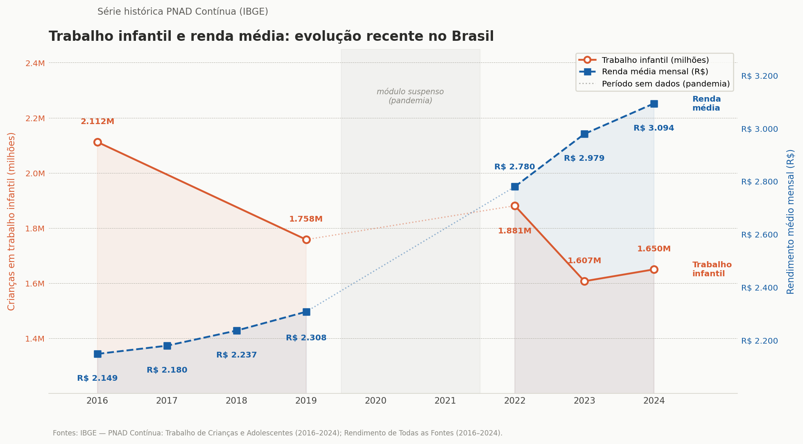

## Muito além de um problema social

O trabalho infantil é caracterizado por atividades realizadas por crianças com idade inferior à mínima permitida para a entrada no mercado de trabalho. Na legislação brasileira, é proibido o emprego de menores de 13 anos em qualquer atividade laboral; a partir dos 14 anos, é possível atuar como aprendiz no Programa Jovem Aprendiz, em atividades compatíveis com o desenvolvimento físico e psicológico do menor. Ainda assim, dados do IBGE revelam que essa prática faz parte da realidade de milhões de brasileiros: em 2024, o país registrou **1,650 milhões de jovens entre 5 e 17 anos** nessa situação, dos quais 66% eram pretos ou pardos, o que evidencia a persistência das desigualdades raciais no cenário.

O [Plano Nacional de Prevenção e Erradicação do Trabalho Infantil e Proteção ao Adolescente Trabalhador](http://www.oit.org.br/sites/default/files/topic/ipec/pub/plan-prevencao-trabalhoinfantil-web_758.pdf) aponta que quanto mais precoce é a entrada no mercado de trabalho, menor é a renda obtida ao longo da vida adulta, perpetuando os altos graus de desigualdade social. Esse ciclo se agrava quando se considera a carga horária imposta aos mais velhos: segundo o IBGE, 30% dos adolescentes de 16 e 17 anos trabalham 40 horas ou mais por semana, o que contribui para a evasão escolar. O afastamento da escola compromete a aquisição de competências essenciais e, consequentemente, o acesso futuro a empregos com trajetórias de crescimento salarial mais sólidas.

::: caixinha-lateral-esq
"Tá, mas e a Economia? - Capital Humano

É o conjunto de conhecimentos, habilidades e competências desenvolvidos por uma pessoa ao longo da vida, principalmente por meio da educação e da experiência profissional. Quanto mais qualificada é a força de trabalho de um país, maior é sua capacidade produtiva e seu potencial de crescimento econômico.
:::

O impacto, portanto, vai além do desenvolvimento individual e afeta também o crescimento econômico e aprofunda a desigualdade estrutural. Países com alta incidência dessa prática tendem a acumular excesso de mão de obra não qualificada, pressionando os salários para baixo. A redução da escolaridade, por sua vez, diminui o capital humano disponível e aumenta a probabilidade de que esses indivíduos permaneçam em situação de pobreza na vida adulta.

## Menos escola, menor produtividade

O trabalho infantil priva a criança da oportunidade de frequentar a escola, obrigando-a a abandoná-la prematuramente ou a tentar conciliar os estudos com jornadas excessivamente longas e pesadas. As famílias desempenham um papel significativo nessa dinâmica, muitas vezes valorizando o benefício de curto prazo do trabalho da criança e não percebendo o retorno de outras atividades, como a escolaridade, o lazer e as brincadeiras, que são componentes importantes do desenvolvimento infantil. Essa percepção está diretamente ligada à forma como a família valoriza essas atividades, conforme aponta a OCDE em relatório dedicado ao tema do trabalho infantil. À medida que as preocupações com a subsistência diminuem, por exemplo, algumas famílias passam a se preocupar mais com a qualidade da educação de seus filhos, optando por reduzir o trabalho infantil mesmo sem mudanças objetivas nessa qualidade.

A série histórica abaixo compara o número de crianças e adolescentes em situação de trabalho infantil (eixo esquerdo) e a renda média domiciliar per capita (eixo direito) entre 2016 e 2024. Embora o gráfico não permita concluir uma relação causal, ele ajuda a visualizar uma associação discutida ao longo do texto: à medida que a renda média das famílias aumenta, o trabalho infantil tende a diminuir.

{width="100%" style="margin: 20px 0;"}

Um estudo realizado em 2020 apontou que trabalhadores brasileiros que anteciparam sua entrada no mercado de trabalho, antes dos 16 anos, ganham em média **21,5% a menos** do que seus pares que ingressaram mais tarde. Uma parcela significativa desse efeito, cerca de 80%, é explicada pelo baixo acúmulo de capital humano decorrente da inserção ocupacional precoce, sugerindo que o efeito do trabalho infantil sobre a renda na vida adulta é potencializado pelos danos causados à continuidade do investimento em educação e qualificação.

Uma força de trabalho com menor escolaridade e qualificação tende a apresentar produtividade mais baixa, limitando a capacidade de inovação e a adoção de tecnologias, o que freia o crescimento econômico de longo prazo. Nesse sentido, o trabalho infantil pode ser entendido como um mecanismo de perpetuação do subdesenvolvimento, ao reduzir o investimento em capital humano das gerações futuras, compromete as bases sobre as quais economias mais dinâmicas e equitativas são construídas.

## O ciclo da pobreza

O trabalho infantil é, simultaneamente, um reflexo e um motor da pobreza persistente e da desigualdade social. Para famílias em situação de extrema vulnerabilidade, a pequena contribuição financeira de uma criança é frequentemente utilizada como uma estratégia de "autosseguro" (ou sobrevivência) para mitigar choques econômicos transitórios, como o desemprego dos pais ou crises de saúde. O custo dessa solução de curto prazo, contudo, cria uma armadilha: ao trocar a escola pelo trabalho precoce, a criança sacrifica o acúmulo de capital humano, reduzindo drasticamente suas chances de obter melhores salários na vida adulta e permanecendo presa à mesma condição social da família.

Esse cenário alimenta a perpetuação intergeracional da pobreza, uma vez que filhos de pessoas que trabalharam na infância possuem maior probabilidade de reproduzir esse ciclo. Estudos da OCDE apontam uma forte persistência desse padrão no Brasil, indicando que muitos trabalhadores infantis tiveram pais que passaram pela mesma situação. O quadro é agravado pela normalização cultural da prática, frequentemente justificada pela ideia de "formar o caráter" ou afastar os jovens da criminalidade.

::: caixinha-lateral-dir
"Tá, mas e a Economia? - Mobilidade Social

Refere-se à capacidade de uma pessoa alcançar condições de vida e renda melhores do que as da geração anterior. Quando crianças entram precocemente no mercado de trabalho e abandonam ou prejudicam sua formação escolar, suas oportunidades futuras diminuem significativamente, dificultando a quebra do ciclo da pobreza e contribuindo para a manutenção da desigualdade social ao longo do tempo.
:::

Esse discurso aparece, inclusive, no debate político contemporâneo. Em declarações recentes, o ex-governador de Minas Gerais, Romeu Zema, defendeu a flexibilização das leis relacionadas ao trabalho infantil ao comparar a realidade brasileira à de crianças que entregam jornais nos Estados Unidos. Na prática, essa visão acaba minimizando graves danos à saúde física e mental dos jovens, como problemas crônicos de coluna e estresse psicológico, fatores que limitam a capacidade produtiva ao longo de toda a vida.

Embora possa parecer uma solução imediata para a sobrevivência familiar, o trabalho infantil produz consequências sociais e econômicas que atravessam gerações.

## O impacto no desenvolvimento do país

Sob uma perspectiva macroeconômica, a presença disseminada de trabalho infantil não representa uma vantagem competitiva, mas sim um obstáculo ao crescimento sustentável. Países com altos índices dessa prática tendem a concentrar uma oferta excessiva de mão de obra pouco qualificada, o que exerce uma pressão depressiva sobre os salários de toda a população adulta e enfraquece a dinâmica salarial de toda a economia.

Além disso, a dependência de mão de obra barata reduz drasticamente os incentivos para o investimento em tecnologia e na modernização produtiva. Como a tecnologia e o capital humano qualificado são complementares, empresas que conseguem operar com trabalhadores de baixo custo e pouca instrução sentem menos necessidade de investir em inovação e eficiência; esse atraso tecnológico, observado historicamente inclusive em setores agrícolas de países desenvolvidos, reduz a produtividade agregada e limita o crescimento do PIB potencial no longo prazo.

A informalidade agrava esse quadro, já que o trabalho infantil concentra-se majoritariamente em ocupações sem fiscalização adequada e em negócios familiares onde não há proteção legal. Essa prevalência de ocupações informais reforça estruturas econômicas de baixa produtividade e crescimento limitado. Combater o trabalho infantil, portanto, vai muito além da assistência social: trata-se também de uma estratégia econômica central voltada ao aumento da qualificação da força de trabalho e ao desenvolvimento do país.

## O que reduz o problema?

Combater o trabalho infantil exige uma abordagem multifacetada que atue simultaneamente na renda familiar e na permanência escolar. Nesse sentido, surgem programas que visam tornar a educação mais vantajosa do que o trabalho precoce. É o caso do Bolsa Família, que combina objetivos de curto e longo prazo. As transferências complementam a renda familiar, permitindo que as famílias adquiram itens essenciais, e funcionam como incentivo para que invistam no capital humano dos filhos, em educação e saúde, contribuindo, no longo prazo, para quebrar a transmissão intergeracional da pobreza.

Os dados do IBGE reforçam essa lógica. Em 2024, o percentual de trabalhadores infantis residentes em domicílios beneficiados pelo Bolsa Família (91,2%) era ligeiramente maior em relação ao total de jovens em situação de trabalho infantil (88,8%), ou seja, mesmo trabalhando, os beneficiários do Bolsa Família apresentavam maior presença na escola. Esse resultado pode estar relacionado às condicionalidades do programa, que exigem acompanhamento escolar como contrapartida.

Além das transferências de renda, é necessário estabelecer sistemas de informação para registrar e monitorar casos, bem como fiscalizar a aplicação das leis e acompanhar os avanços no combate ao problema. Ações coordenadas em todos os níveis de tomada de decisão são igualmente essenciais para identificar situações de risco, fornecer uma solução alternativa e garantir o suporte necessário para que essas crianças retornem e permaneçam na escola.

::: caixinha-lateral-esq
"Tá, mas e a Economia? - Transferência de renda

É quando o governo repassa dinheiro diretamente a famílias em situação de vulnerabilidade, sem exigir nada em troca além do cumprimento de algumas condições básicas, como manter os filhos na escola ou em dia com as vacinas. O objetivo é garantir uma renda mínima para quem mais precisa, reduzindo a pobreza e a desigualdade social.
:::

O trabalho infantil vai muito além de uma questão puramente assistencial ou moral. Quando crianças e adolescentes trocam a sala de aula pelo trabalho precoce, o país perde capital humano, reduz sua produtividade e limita sua capacidade de inovação e crescimento econômico. Além de comprometer o futuro desses jovens, a prática contribui para a perpetuação da pobreza e da desigualdade social entre gerações.

Erradicar o trabalho infantil, portanto, não é apenas uma medida de proteção social, mas também uma estratégia econômica indispensável. Investir em educação, permanência escolar e transferência de renda significa fortalecer o desenvolvimento do país e construir uma economia mais produtiva e menos desigual.

::: callout-tip
#### ODS 8 — Trabalho Decente e Crescimento Econômico

Esse tema se conecta ao ODS 8, que tem como uma de suas metas erradicar o trabalho infantil em todas as suas formas. O problema também dialoga com o ODS 1 (Erradicação da Pobreza), o ODS 4 (Educação de Qualidade) e o ODS 10 (Redução das Desigualdades), reforçando que superar esse desafio exige avanços simultâneos em renda, escolaridade e equidade social.
:::

**Transparência em Uso de IA:** Ferramentas: Claude e ChatGPT-4. Uso: auxílio à revisão de fluidez textual e apoio na apresentação visual de elemento gráfico. As autoras revisaram todo o conteúdo e assumem integral responsabilidade pela versão final.

**Para saber mais:**

OCDE. *Child Labour: Causes, Consequences and Policy Responses*. Paris: OECD Publishing, 2019. Disponível em: <https://dx.doi.org/10.1787/f6883e26-en>.

SANTOS, Mateus Mota dos. *Efeitos do trabalho infantil sobre o rendimento futuro do trabalho via mediação da educação*. 2020. Disponível em: <https://doi.org/10.54766/rberu.v14i4.632>.

::: botoes-fim-de-pagina
[Voltar para a Newsletter](indexNe.qmd){.btn-voltar}

[Ler o próximo texto](Estilo12.qmd){.btn-proximo}
:::
