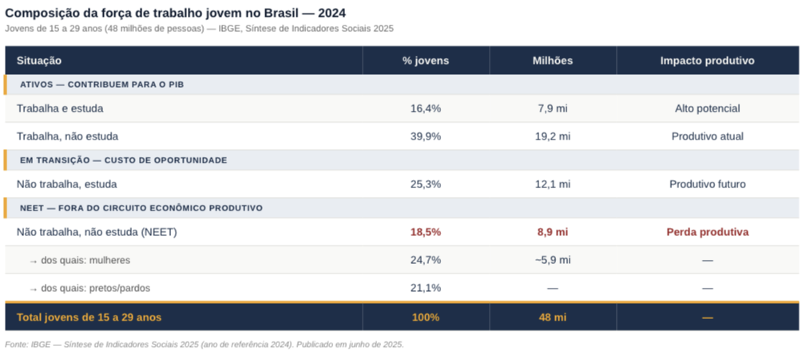

## O paradoxo do mercado de trabalho brasileiro

Em 2025, o Brasil registrou a menor taxa anual de desocupação de toda a série histórica da PNAD Contínua: **5,6%**. A população ocupada chegou a 103 milhões de pessoas, também recorde. À primeira vista, os dados sugerem um mercado de trabalho saudável. Mas por que, então, empresas de diferentes setores relatam dificuldade crescente para contratar profissionais com o perfil adequado?

A resposta está em uma distinção fundamental da teoria econômica: a diferença entre desemprego e desocupação estrutural. O desemprego mede quem está sem trabalho e ativamente o procura. Mas há uma parcela expressiva da população que simplesmente saiu da força de trabalho, não procura emprego, não estuda e não aparece nas estatísticas convencionais de desemprego. Em 2024, esse grupo somava **8,9 milhões de jovens entre 15 e 29 anos**, segundo o IBGE, representando 18,5% dessa faixa etária.

::: caixinha-lateral-esq
"Tá, mas e a Economia? - NEET e população desalentada

NEET é a sigla em inglês para "Not in Employment, Education or Training", jovens que não trabalham, não estudam e não estão em formação. Na prática, esse grupo não entra na taxa de desemprego convencional porque não está ativamente procurando trabalho. Isso cria uma ilusão estatística: o desemprego pode cair enquanto o NEET cresce, mascarando o verdadeiro tamanho do problema de subutilização da força de trabalho. O conceito se diferencia do desalento, que é mais amplo: o desalentado é quem desistiu de procurar emprego por acreditar que não encontrará.
:::

## A troca geracional e o mismatch de habilidades

O Brasil vive dois movimentos demográficos simultâneos que se chocam no mercado de trabalho. De um lado, trabalhadores experientes se aposentam levando consigo conhecimento acumulado durante décadas. De outro, uma nova geração entra com perfil radicalmente diferente: maior familiaridade digital e novas expectativas sobre flexibilidade, mas frequentemente com lacunas de qualificação técnica para as vagas disponíveis. O resultado é o que Dale Mortensen e Christopher Pissarides, Nobel de Economia em 2010, descrevem como *mismatch* de habilidades: vagas e trabalhadores existem, mas são incompatíveis.

No Brasil, esse desencontro tem três dimensões simultâneas. A primeira é a qualificação técnica insuficiente para setores em expansão, como tecnologia, saúde e agronegócio tecnificado. A segunda é o salário de reserva elevado: parte dos jovens, especialmente em regiões metropolitanas periféricas, prefere a informalidade ou o desalento a aceitar as condições oferecidas pelo mercado formal para trabalhadores sem experiência. A terceira é o *mismatch* geográfico: as vagas se concentram em regiões diferentes de onde a força de trabalho disponível está localizada. Os dados do IBGE confirmam a assimetria: enquanto a taxa de desocupação geral foi de 5,6% em 2025, entre jovens de 15 a 24 anos chegou a **14,9%** no primeiro trimestre.

::: caixinha-lateral-dir
"Tá, mas e a Economia? - Salário de reserva

É o valor mínimo abaixo do qual um trabalhador prefere não trabalhar. Ele depende das alternativas disponíveis: informalidade, transferências de renda ou suporte familiar. Quando o salário de reserva supera o que o mercado oferece para determinada qualificação, o trabalhador sai voluntariamente da força de trabalho, sem figurar nas estatísticas de desemprego.
:::

## Impacto na produtividade: o custo invisível

A teoria do capital humano, desenvolvida por Gary Becker, distingue dois tipos de conhecimento produtivo. O capital humano geral compreende habilidades transferíveis entre empresas — programar, calcular, comunicar. O capital humano específico é o conhecimento útil apenas dentro de uma organização ou setor: processos internos, relações com clientes, cultura da empresa. Esse segundo tipo leva anos para ser construído e raramente está documentado.

Quando trabalhadores experientes saem sem que haja transferência estruturada desse conhecimento, as empresas sofrem uma perda de eficiência real e invisível nas estatísticas. Os jovens que entram podem ter habilidades gerais superiores — especialmente em tecnologia —, mas precisam de tempo para reconstruir o capital específico perdido. No Brasil, esse hiato é amplificado por um dado estrutural: segundo o FGV IBRE, a produtividade do trabalho cresceu apenas cerca de **1% ao ano nos últimos 30 anos**. Com a saída de trabalhadores experientes e a entrada de jovens com defasagens de qualificação, a tendência é de pressão adicional sobre essa já baixa trajetória.

::: caixinha-lateral-esq
"Tá, mas e a Economia? - Capital humano e capital humano específico

Conceito de Gary Becker que descreve o conjunto de habilidades, conhecimentos e experiências que tornam um trabalhador mais produtivo. Divide-se em capital humano geral (transferível entre empresas, como leitura e cálculo) e específico (útil apenas dentro de uma organização ou setor). A troca geracional ameaça principalmente o segundo tipo, que é construído na prática e raramente documentado.
:::

{width="100%" style="margin: 20px 0;"}

## Desigualdade estrutural e o NEET no Brasil

Os dados do IBGE revelam que o fenômeno NEET no Brasil não é homogêneo, ele é profundamente marcado por desigualdades de gênero, raça e renda. Entre as mulheres jovens, **24,7%** estão fora do trabalho e dos estudos, quase o dobro do percentual masculino (12,5%). Entre jovens pretos ou pardos, o índice chega a 21,1%, contra 14,4% entre brancos.

Essa distribuição não é acidental. Ela reflete falhas estruturais que a teoria econômica identifica como externalidades negativas do mercado: a falta de creches e equipamentos de cuidado empurra mulheres jovens para fora da força de trabalho; a concentração de empregos formais em regiões com menor presença de populações negras e pardas cria *mismatch* geográfico; a baixa qualidade da educação pública em regiões periféricas reduz o capital humano geral acumulado antes da entrada no mercado.

O resultado econômico é uma subutilização crônica de capital humano. Um jovem que passa anos fora do mercado de trabalho e da escola não apenas deixa de produzir no presente: ele deprecia seu próprio capital humano, tornando mais difícil e custosa sua reinserção futura. Esse processo, que a literatura econômica chama de **histerese do desemprego**, transforma o que poderia ser um problema transitório em uma perda permanente de produtividade para a economia.

::: caixinha-lateral-dir
"Tá, mas e a Economia? - Histerese do desemprego

Histerese é um conceito da física que descreve situações em que um sistema, ao ser perturbado, não retorna ao estado original mesmo após cessar a perturbação. No mercado de trabalho, a histerese do desemprego descreve o fenômeno pelo qual períodos prolongados fora do trabalho deterioram as habilidades do trabalhador, reduzem sua rede de contatos profissionais e geram um sinal negativo para os empregadores, tornando a recontratação progressivamente mais difícil. Para jovens que passaram anos como NEET, o efeito é particularmente severo: o mercado os penaliza não só pela falta de experiência, mas pela lacuna em si.
:::

## Perspectivas e o papel das políticas públicas

A queda do índice NEET de 22,4% em 2019 para 18,5% em 2024 é um avanço real, mas ainda deixa o Brasil em patamar superior ao de países comparáveis. Enquanto a média dos países da OCDE ficou em 13,8% em 2023, o Brasil registrava 24% na faixa de 18 a 24 anos, segundo o relatório *Education at a Glance* da OCDE.

Do ponto de vista econômico, reverter esse quadro exige intervenções em múltiplas frentes simultâneas. A teoria do capital humano sugere que investimentos em educação de qualidade, especialmente técnica e profissional, são os de maior retorno social a longo prazo. Mas a histerese do desemprego indica que programas de reinserção ativa, que ofereçam não apenas qualificação, mas intermediação real com o mercado, são igualmente necessários para quem já está fora do circuito.

Para as empresas, a gestão da transição geracional é um desafio estratégico crescente. Programas estruturados de transferência de conhecimento, mentoria reversa, em que jovens ensinam habilidades digitais a trabalhadores mais velhos enquanto absorvem seu conhecimento tácito, e maior flexibilidade nos modelos de contratação são respostas que começam a aparecer nos setores mais dinâmicos da economia brasileira. A troca geracional não precisa ser uma perda: gerenciada de forma adequada, pode ser um vetor de renovação produtiva.

::: callout-tip
#### ODS 4 e ODS 8 — Educação de Qualidade e Trabalho Decente

O fenômeno NEET e a troca geracional mal gerenciada comprometem dois objetivos centrais da Agenda 2030 da ONU. O ODS 4 é afetado porque 8,7 milhões de jovens brasileiros entre 14 e 29 anos não haviam completado o ensino médio em 2024, segundo o IBGE — base mínima para o capital humano geral que o mercado de trabalho exige.

O ODS 8 é diretamente impactado porque o crescimento econômico sustentável depende de uma força de trabalho produtiva e bem empregada. Com 18,5% dos jovens fora do trabalho e dos estudos e uma produtividade do trabalho que cresce menos de 1% ao ano, o Brasil está em trajetória incompatível com as metas de crescimento inclusivo que o objetivo pressupõe.
:::

**Transparência em Uso de IA:** A ferramenta de inteligência artificial Claude (Anthropic) foi utilizada para apoio à pesquisa de dados, estruturação do texto e revisão de estilo. Toda a análise econômica, a escolha dos conceitos teóricos e a argumentação foram desenvolvidas e revisadas pelos autores, que assumem integral responsabilidade pelo conteúdo publicado.

**Fontes:**

IBGE. *Síntese de Indicadores Sociais: uma análise das condições de vida da população brasileira*. Rio de Janeiro: IBGE, 2025. Disponível em: <https://www.ibge.gov.br/estatisticas/sociais/educacao/9221-sintese-de-indicadores-sociais.html>. Acesso em: maio 2026.

IBGE. *Pesquisa Nacional por Amostra de Domicílios Contínua — PNAD Contínua*. Rio de Janeiro: IBGE, 2026. Disponível em: <https://www.ibge.gov.br/estatisticas/sociais/trabalho/9173-pesquisa-nacional-por-amostra-de-domicilios-continua-trimestral.html>. Acesso em: maio 2026.

IPEA. *Carta de Conjuntura — Mercado de Trabalho*. Brasília: IPEA, 2025. Disponível em: <https://www.ipea.gov.br/cartadeconjuntura>. Acesso em: maio 2026.

::: botoes-fim-de-pagina
[Voltar para a Newsletter](indexNe.qmd){.btn-voltar}

[Ler o próximo texto](Estilo10.qmd){.btn-proximo}
:::
