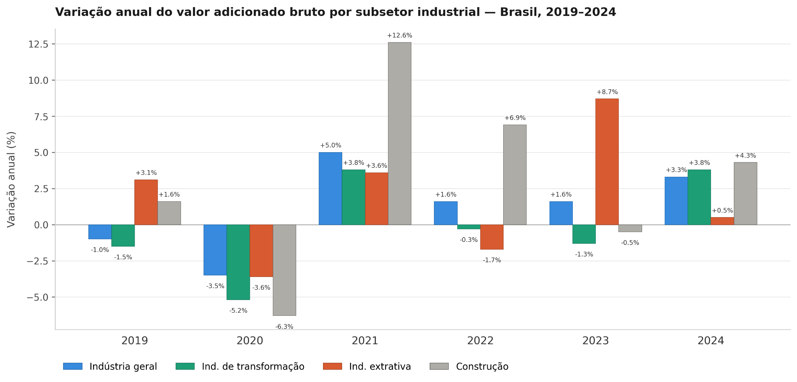

## A abordagem clássica de desindustrialização

Embora frequentemente associem-se fábricas fechando as portas com crises, a teoria econômica explica que a desindustrialização pode, por vezes, ser um fenômeno considerado positivo. Quando se fala nos países desenvolvidos, por exemplo, já é frequente a imagem de uma economia voltada para o setor de serviços e informação. A fim de compreender como se dá o processo de desindustrialização, para o caso de economias desenvolvidas, a teoria econômica explica o fenômeno pelo lado da demanda e pelo lado da oferta.

Como pontuado no relatório *Desindustrialização — Causas e Impactos* (Fundo Monetário Internacional, 1997), a Lei de Engel é o que explica o lado da demanda. Originalmente, essa lei explica que, com a elevação da renda, as famílias deixam de gastar a maior parte do seu dinheiro apenas com sobrevivência e passam a consumir bens físicos, como roupas, móveis e eletrodomésticos. Mas, à medida que avançou o enriquecimento de países industrializados no período pós-guerra, ocorreu uma saturação da demanda por manufaturados. Afinal, há um limite prático para a quantidade de bens como geladeiras, carros e sapatos que uma família precisa ou consegue consumir. Assim, o excedente de renda em economias de elevado PIB per capita passa a ser direcionado para o setor de serviços e, como este não tem o mesmo grau de produtividade da indústria, sua participação nominal torna-se mais relevante, de forma que a força de trabalho e o capital da indústria, no limite, passam a ser transferidos para o setor de serviços.

Diz-se que, com o avanço no desenvolvimento de tecnologias poupadoras de trabalho e, logo, o aumento da produtividade, diminuiu-se proporcionalmente a força de trabalho necessária para o campo. Com o êxodo rural, o aumento de trabalhadores no meio urbano viabilizou a Revolução Industrial. O lado da oferta da desindustrialização não segue uma trajetória tão diferente. Isto ocorre pois o descompasso no crescimento da produtividade da indústria em relação ao setor de serviços faz com que a manufatura exija cada vez menos empregados, transferindo a força de trabalho para os serviços. Dando um exemplo simples, mas factível, entre 1998 e 2021, o preço de uma televisão nos EUA despencou 97%. O preço de brinquedos caiu 70% e o de carros novos permaneceu praticamente estável. No mesmo intervalo de tempo, o custo dos serviços hospitalares aumentou em 225% e as mensalidades universitárias subiram em 180%, ambos acima da inflação média acumulada de 65% do período. Ou seja, os serviços precisam de uma proporção cada vez maior da força de trabalho para conseguir atender a uma sociedade mais rica. Nos EUA, 56% da força de trabalho se encontrava no setor de serviços em 1960, aumentando para 73% em 1994. Já nos 15 países da União Europeia, a quota de emprego no setor da manufatura encontrava-se superior a 30% em 1970, caindo para 20% em 1994.

## O caso geral da desindustrialização prematura

::: caixinha-lateral-esq
**“Tá, mas e a economia?” — Catching-up econômico**

O catching-up econômico é o processo pelo qual os países pobres crescem mais rápido do que os ricos, adotando tecnologias já existentes para dar saltos de produtividade. Historicamente, a manufatura operou desta forma.
:::

A desindustrialização prematura, formalizada na literatura da corrente principal da teoria econômica por autores como Dani Rodrik, caracteriza-se pelo declínio da participação do emprego e do valor agregado da manufatura em economias em desenvolvimento. Impulsionadas pela globalização e pelo progresso tecnológico, as nações emergentes reduzem suas oportunidades de industrialização precocemente. Isto pois, como a indústria de transformação exibe convergência de produtividade e alta capacidade de absorver trabalho de baixa qualificação, sua contração elimina o principal vetor estrutural de catching-up econômico.

Diferente da desindustrialização clássica, na qual a mão de obra migra para serviços em decorrência da produtividade industrial, na variante prematura o trabalhador é absorvido por setores de serviços informais e de baixa produtividade, antes que a economia atinja a maturidade tecnológica. Essa não mudança estrutural pode prejudicar economias emergentes, reduzindo o potencial de crescimento de longo prazo e o aumento do produto per capita ao nível de países desenvolvidos, dado que os serviços tradicionais não possuem as mesmas dinâmicas de ganhos de escala e absorção de tecnologias de fora.

## Industrialização brasileira e perda de relevância no PIB

No caso brasileiro, a industrialização não ocorreu por acaso, mas sim por uma decisão deliberada do Estado ao apostar no modelo de Substituição de Importações (ISI) como forma de desenvolvimento. Esse processo foi iniciado na Era Vargas, acelerado pelo Plano de Metas de Juscelino Kubitschek e consolidado pelo "Milagre Econômico" durante o Regime Militar.

A preços constantes, o auge da participação da indústria de transformação ocorreu na década de 1970, entre 1973 e 1976, quando respondia por cerca de 22% a 23% do valor adicionado. Já a preços correntes, o pico estatístico aparece em 1985, atingindo cerca de 35,9% do valor adicionado, patamar este fortemente inflado pelas distorções provocadas pelo ambiente de hiperinflação da época. Essa longa construção estrutural foi sustentada por tarifas alfandegárias elevadas, forte financiamento estatal via BNDES e pela atração de multinacionais, como o setor automotivo no governo de Juscelino Kubitschek.

::: caixinha-lateral-dir
**“Tá, mas e a economia?” — PIB e valor adicionado: qual a diferença?**

O Produto Interno Bruto (PIB) mede o valor de mercado de todos os bens e serviços finais produzidos em uma economia num dado período. O valor adicionado bruto (VAB), por sua vez, é o que cada setor efetivamente contribui para esse total. A relação entre os dois é direta: o PIB a preços de mercado equivale à soma do VAB de todos os setores acrescida dos impostos líquidos de subsídios sobre produtos.
:::

Todavia, a segunda metade da década de 1980 marcou o ponto de inflexão e o início do declínio relativo do setor. O processo de redemocratização trouxe consigo uma gradual abertura comercial, intensificada no governo Collor, 1990-1992, que reduziu abruptamente as tarifas de importação. Ao romper com décadas de isolamento artificial, a abertura comercial inevitavelmente expôs as severas ineficiências acumuladas por uma indústria nacional que havia crescido sob o manto do protecionismo estatal. Sem os incentivos de mercado para inovação e aumento de produtividade, o setor manufatureiro enfrentou um choque de competitividade incontornável diante de produtos estrangeiros que já operavam sob a fronteira tecnológica global, oferecendo maior qualidade a menores preços. Como consequência, a década de 1990 consolidou o fenômeno da desindustrialização precoce, caracterizado pela perda de relevância industrial antes mesmo que o país atingisse a maturidade de renda per capita vista nas economias desenvolvidas.

::: caixinha-lateral-esq
**“Tá, mas e a economia?” — Doença Holandesa**

Conceito formulado por Corden e Neary (1982) para descrever como o boom exportador de um setor primário aprecia o câmbio real e retira competitividade do setor manufatureiro. O fenômeno opera por dois canais: o efeito de gasto, que eleva a demanda por bens e serviços que não podem ser comercializados internacionalmente e pressiona o câmbio; e o efeito de realocação, que drena trabalho e capital da indústria para o setor de recursos naturais.
:::

No início dos anos 2000, observou-se uma breve recuperação setorial impulsionada pela desvalorização cambial, que devolveu competitividade às exportações manufaturadas. Contudo, a partir de 2005, o boom global de commodities desencadeou um mecanismo clássico de Doença Holandesa que provocou uma forte e contínua valorização do real, revertendo esses ganhos cambiais.

Desde então, o setor passou a sofrer com os fatores crônicos do "Custo Brasil". Sob a ótica macroeconômica, o câmbio apreciado em ciclos, a taxa Selic estruturalmente elevada, algo necessário para conter pressões inflacionárias diante de fragilidades fiscais, uma carga tributária complexa e cumulativa, além de graves gargalos de infraestrutura logística, atuaram como barreiras sistêmicas. Esse ambiente minou a Produtividade Total dos Fatores (PTF) e empurrou a participação da indústria de transformação para suas mínimas históricas nas últimas décadas.

## Recente mudança de trajetória de certos setores industriais

No contexto recente, a pandemia de Covid-19 (2020) representou mais um severo choque de oferta e demanda, resultando em uma queda de 3,5% no volume adicionado da Indústria Geral. A partir de 2021, observou-se uma recuperação real, porém marcada por uma profunda assimetria setorial que se aprofundou ao longo do período. No primeiro ano, a recuperação foi liderada pelo crescimento da construção civil, em 12,6%, e pela indústria de transformação, em 3,8%, ambas beneficiadas pela retomada da demanda interna e pelos estímulos fiscais emergenciais que sustentaram o consumo de bens duráveis e insumos de construção. A indústria extrativa, por sua vez, cresceu de forma mais modesta, em 3,6%, e chegou a recuar 1,7% em 2022, pressionada pela queda nos preços e volume do minério de ferro.

{width="100%" style="margin: 20px 0;"}

A disparidade estrutural atingiu seu ápice em 2023, quando a dinâmica se inverteu radicalmente: a extrativa avançou 8,7%, puxada pela expansão da extração de petróleo, gás natural e retomada do minério de ferro, ao passo que a indústria de transformação registrou sua segunda contração consecutiva de 1,3%, penalizada pela taxa Selic em patamar restritivo, pela retração dos investimentos em máquinas e equipamentos e pela queda na produção química. Essa divergência ilustra com precisão o mecanismo de Doença Holandesa em operação: enquanto o setor primário-exportador se beneficiava do câmbio depreciado e da demanda externa, o setor manufatureiro sofria simultaneamente o encarecimento do crédito doméstico e a concorrência de importados favorecidos pela mesma dinâmica cambial.

Já em 2024, o setor industrial consolidou uma expansão de 3,3% no valor adicionado (SCN/IBGE), com a indústria de transformação revertendo a tendência negativa ao crescer 3,8%, seu melhor resultado desde 2021. Esse desempenho foi impulsionado especialmente pelos crescimentos dos segmentos de bens de capital, de 9,1%, e bens de consumo duráveis, de 10,6%, com destaque para veículos automotores, metalurgia e máquinas e equipamentos elétricos, beneficiados pela expansão do crédito e pela recuperação da confiança empresarial.

::: callout-tip
#### ODS 9 — Indústria, inovação e infraestrutura

Esse tema se conecta ao ODS 9, ao tratar de industrialização e desindustrialização, bem como de suas características e consequências.
:::

**Transparência em Uso de IA:** Ferramentas: Gemini e Claude. Uso: geração de código em Python para construção do gráfico, busca de fontes de pesquisa adequadas e revisão gramatical. O conteúdo foi integralmente revisado pelos autores, que assumem responsabilidade pela versão final.

**Referências:**

RODRIK, Dani. *Premature deindustrialization*. Journal of Economic Growth, v. 21, n. 1, p. 1-33, mar. 2016. DOI: 10.1007/s10887-015-9122-3. Disponível em: <https://doi.org/10.1007/s10887-015-9122-3>.

IBGE — INSTITUTO BRASILEIRO DE GEOGRAFIA E ESTATÍSTICA. *PIB cresce 2,9% em 2023 e fecha o ano em R\$ 10,9 trilhões*. Agência de Notícias IBGE, Rio de Janeiro, 1 mar. 2024. Disponível em: <https://agenciadenoticias.ibge.gov.br/agencia-sala-de-imprensa/2013-agencia-de-noticias/releases/39303-pib-cresce-2-9-em-2023-e-fecha-o-ano-em-r-10-9-trilhoes>. Acesso em: 25 jun. 2026.

PERRY, Mark J. *Chart of the day… or century?* American Enterprise Institute (AEI), Washington, DC, 12 jan. 2022. Disponível em: <https://www.aei.org/carpe-diem/chart-of-the-day-or-century-8/>. Acesso em: 27 jun. 2026.

::: botoes-fim-de-pagina
[Voltar para a Newsletter](indexNe.qmd){.btn-voltar}

[Ler o próximo texto](Estilo15.qmd){.btn-proximo}
:::
