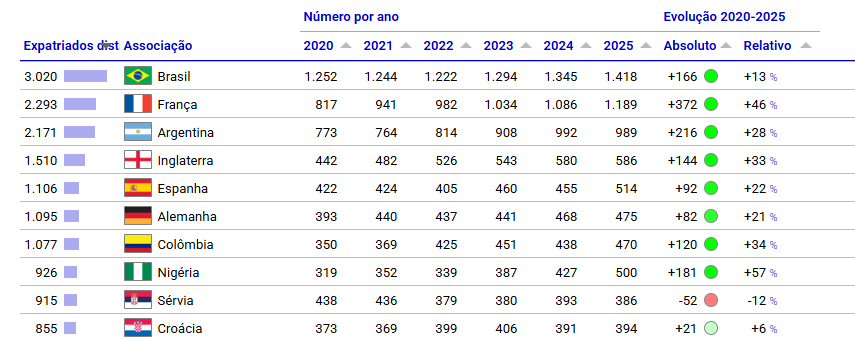

## O Brasil como exportador de talentos

O Brasil é considerado um berço global do futebol e ocupa, há anos, uma posição singular no cenário mundial, não apenas pelas conquistas em campo, mas também pelo que acontece fora dele. Segundo o relatório mais recente do Observatório do Futebol do Centro Internacional de Estudos Esportivos (CIES), o país lidera o ranking global de exportações de jogadores: mais de 1.400 atletas brasileiros atuam em 135 ligas estrangeiras, à frente de França e Alemanha.

{width="100%" style="margin: 20px 0;"}

*A primeira coluna refere-se ao número de jogadores expatriados distintos por país de origem. Fonte: edição número 505 do Boletim Semanal do Observatório de Futebol do CIES.*

Portugal é o principal destino desses jogadores, com cerca de 182 atletas brasileiros atuando por lá, o que reflete, em parte, os laços históricos e a facilidade de adaptação cultural e linguística. Mas a presença brasileira vai muito além: da Coreia do Sul à Indonésia, do Vietnã aos Emirados Árabes, dificilmente existe um campeonato relevante no mundo sem ao menos um nome do Brasil em campo.

O que esses números revelam é que o futebol brasileiro funciona como uma cadeia produtiva robusta, capaz de formar, desenvolver e "exportar" um ativo altamente valorizado no mercado internacional: o talento humano.

## Como se forma um jogador?

Por trás de cada atleta que embarca para jogar no exterior há um longo e custoso processo de formação. Tudo começa nas chamadas categorias de base, as divisões de jovens que os clubes mantêm para identificar e desenvolver talentos desde a infância, muitas vezes a partir dos 8 ou 9 anos de idade.

::: caixinha-lateral-esq
**“Tá, mas e a economia?” — Capital humano**

É o conjunto de conhecimentos, habilidades e experiências que uma pessoa desenvolve ao longo da vida e que a tornam mais produtiva. Quando um clube investe anos formando um jogador, está, essencialmente, construindo capital humano.
:::

Esse processo exige investimento contínuo: instalações esportivas, comissão técnica especializada, suporte médico, alimentação, moradia para atletas de outras cidades e, em muitos casos, apoio às famílias. É um compromisso de longo prazo, sem garantia de retorno imediato.

Marcelo Teixeira, presidente do Santos FC, clube historicamente reconhecido por revelar grandes nomes do futebol mundial, resumiu essa lógica em entrevista ao jornal espanhol AS, ao comentar o papel das categorias de base no clube:

> "O desenvolvimento de jogadores de base sempre fez parte do DNA do Santos e representa um pilar essencial para o presente e o futuro do clube. Este é um recurso inesgotável, mas que exige gestão responsável e investimento contínuo."

O raciocínio econômico por trás disso é direto: os clubes funcionam como empresas que investem hoje esperando um retorno no futuro. Assim como uma indústria investe em máquinas ou tecnologia para aumentar sua produção, os clubes investem em pessoas, apostando que o talento bruto, com o treinamento certo, se tornará um ativo valioso.

## Quando o investimento gera retorno

O momento em que esse modelo econômico se concretiza é a transferência internacional, quando um clube estrangeiro compra um jogador formado no Brasil. Os números mais recentes mostram que esse mercado nunca esteve tão aquecido.

Em 2025, as receitas com transferências de atletas pelos clubes da Série A atingiram **R\$ 3,9 bilhões**, o maior valor já registrado pelo futebol brasileiro, com crescimento de 63% em relação ao ano anterior. Para efeito de comparação, a receita total dos clubes da Série A foi de R\$ 14,3 bilhões no período, de modo que as transferências responderam por cerca de 27% desse total.

::: caixinha-lateral-dir
**“Tá, mas e a economia?” — ROI**

Significa "retorno sobre investimento". É a medida de quanto você ganhou em relação ao que gastou. Se um clube investe R\$ 500 mil na formação de um jogador e o vende por R\$ 50 milhões, o retorno é altíssimo, e é exatamente esse cálculo que explica por que a base virou o negócio mais lucrativo do futebol brasileiro.
:::

Alguns negócios recentes ajudam a entender a escala do fenômeno. O Palmeiras negociou Endrick com o Real Madrid por 47,5 milhões de euros fixos, valor que pode superar os 70 milhões com bônus, e logo depois vendeu Estêvão ao Chelsea por 45 milhões de euros.

A lógica econômica por trás disso é direta: o clube investe na formação por um custo relativamente baixo e, anos depois, vende o atleta por um valor muito superior.

Mas há uma virada importante nessa história: parte significativa desse dinheiro está sendo reinvestida dentro do próprio país. Na janela de transferências mais recente, os clubes brasileiros desembolsaram 245 milhões de euros em contratações, superando ligas tradicionais como a italiana e a espanhola, ficando atrás apenas da Premier League inglesa.

## O futebol e outras exportações brasileiras

Quando olhamos para a balança comercial brasileira, os protagonistas costumam ser sempre os mesmos: soja, minério de ferro e petróleo. Esses produtos têm algo em comum. Sua fonte de valor está na terra, no subsolo e em recursos naturais que o Brasil tem em abundância. O futebol conta uma história diferente.

Enquanto commodities dependem de condições geográficas que não se replicam, o futebol depende de algo que pode ser construído: conhecimento, treinamento, disciplina e tempo investido em pessoas. Não existe uma mina de jogadores esperando para ser explorada, mas um processo contínuo de formação dentro dos clubes.

Essa diferença muda tudo do ponto de vista econômico. Enquanto recursos naturais dependem da disponibilidade física, o capital humano depende da capacidade de formar e desenvolver pessoas. A principal riqueza produzida pelo futebol brasileiro, portanto, não está no solo, mas nas pessoas.

## O que o futebol ensina sobre desenvolvimento econômico?

Se o Brasil é capaz de formar, em série, jogadores disputados pelos principais clubes do mundo, fica a pergunta: por que essa mesma lógica não se repete com a mesma intensidade em áreas como ciência, tecnologia e engenharia?

Os clubes brasileiros desenvolveram, ao longo de décadas, uma estrutura sofisticada para identificar talentos jovens e investir continuamente em seu desenvolvimento, mesmo sem garantia de retorno imediato. O resultado é uma cadeia de formação capaz de gerar profissionais valorizados internacionalmente.

Países que alcançaram altos níveis de desenvolvimento econômico costumam ter algo em comum: investimentos consistentes em capital humano, seja por meio da educação básica, da formação técnica ou do ensino superior. O futebol brasileiro funciona quase como uma prova de conceito, mostrando que, quando há investimento estruturado, o país é capaz de formar talentos de classe mundial.

Fica a reflexão sobre até que ponto esse mesmo modelo poderia inspirar outras áreas da economia, ampliando a capacidade de formação de profissionais altamente qualificados.

No fim das contas, o futebol brasileiro mostra algo que costuma passar despercebido nas discussões econômicas. Por trás de cada jogador negociado no mercado internacional existe um longo processo de formação. Cada atleta que deixa o país para atuar no exterior carrega consigo anos de treinamento, investimento e desenvolvimento de habilidades que se transformaram em valor econômico.

Esse modelo não é exclusividade do esporte. Ele ilustra um princípio econômico mais amplo: investimentos em qualificação e capacitação podem gerar retornos significativos ao longo do tempo. O sucesso brasileiro na formação de jogadores mostra como o desenvolvimento de talentos pode se transformar em uma importante fonte de valor econômico.

::: callout-tip
#### ODS 8 — Trabalho decente e crescimento econômico

O tema dialoga com o ODS 8, que incentiva a geração de emprego produtivo e o crescimento econômico sustentável. A formação de atletas mostra, na prática, como investimentos em qualificação e desenvolvimento de pessoas podem gerar oportunidades e criar valor econômico.
:::

**Transparência em Uso de IA:** Ferramentas: Claude e ChatGPT. Uso: apoio na revisão textual e na organização do conteúdo. As autoras revisaram integralmente o material e assumem total responsabilidade pela versão final.

**Para saber mais:**

POLI, Raffaele; RAVENEL, Loïc; BESSON, Roger. *Football expatriates 2020–2025*. Neuchâtel: CIES Football Observatory, 2025. (Monthly Report, n. 100). Disponível em: <https://football-observatory.hflip.co/MonthlyReport100>. Acesso em: 24 jun. 2026.

::: botoes-fim-de-pagina
[Voltar para a Newsletter](indexNe.qmd){.btn-voltar}

[Ler o próximo texto](Estilo13.qmd){.btn-proximo}
:::
