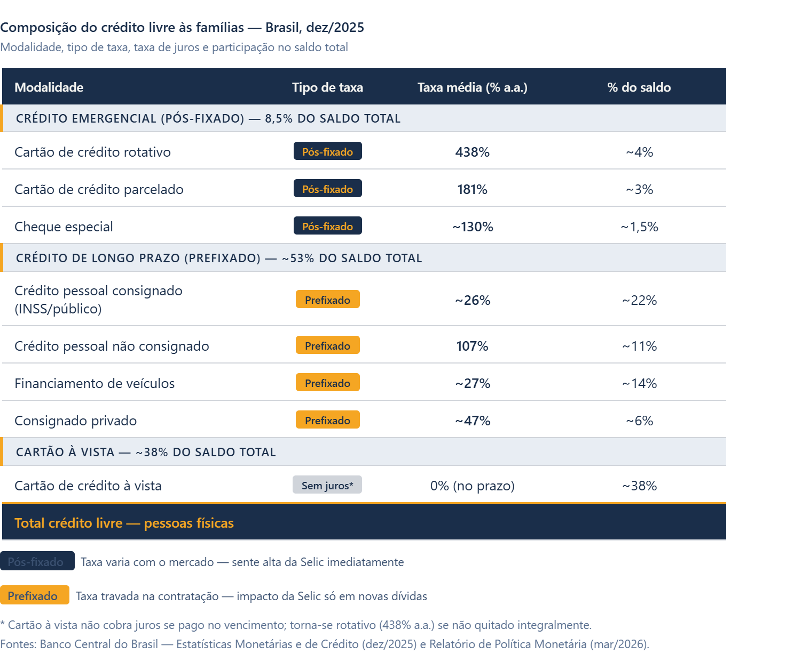

## O que é inadimplência e por que ela cresce

::: caixinha-lateral-esq
"Tá, mas e a Economia? - Serviço da dívida

O serviço da dívida corresponde ao conjunto de pagamentos periódicos que um devedor realiza para honrar seus compromissos — principal e juros. No Brasil, a maior parte das dívidas de consumo das famílias é prefixada, ou seja, a taxa é definida no momento da contratação. Nesses casos, a alta da Selic não encarece as parcelas de quem já deve, mas eleva o custo de quem precisa contratar novo crédito ou refinanciar dívidas existentes. Já nas modalidades pós-fixadas, como o cartão de crédito rotativo e o cheque especial, a alta dos juros impacta imediatamente o saldo devedor, amplificando o risco de inadimplência justamente nas linhas mais caras do mercado.
:::

A inadimplência, do ponto de vista econômico, representa o descumprimento de obrigações financeiras no prazo contratualmente estabelecido. Ela não é apenas um fenômeno individual; quando generalizada, sinaliza que há uma desproporção estrutural entre o nível de endividamento de famílias e empresas e sua capacidade de geração de renda. Em fevereiro de 2026, a Serasa Experian registrou 81,7 milhões de CPFs negativados no Brasil, o maior número da série histórica.

Para a teoria econômica, esse nível de inadimplência não surge do nada. Ele é o resultado visível de um processo que começa quando os agentes econômicos tomam crédito a taxas elevadas, comprometendo parcelas crescentes de sua renda futura. Quando o custo do serviço da dívida supera a capacidade de pagamento, a inadimplência é a consequência inevitável.

## O papel dos juros compostos e do crédito rotativo

::: caixinha-lateral-dir
"Tá, mas e a Economia? - Juros compostos

Nos juros simples, os encargos incidem sempre sobre o capital original. Nos juros compostos, eles incidem sobre o saldo acumulado — capital mais juros já vencidos. Essa diferença parece pequena, mas produz efeitos radicalmente distintos ao longo do tempo. Uma dívida com juros compostos de 10% ao mês dobra em aproximadamente 7 meses. A 438% ao ano (equivalente a cerca de 16% ao mês), o crescimento é devastador. A fórmula é: **M = C × (1 + i)ⁿ**, onde M é o montante final, C é o capital inicial, i é a taxa de juros por período e n é o número de períodos.
:::

Para compreender a dinâmica atual, é necessário entender a mecânica dos juros compostos, o chamado "juro sobre juro". Quando um consumidor não paga integralmente a fatura do cartão de crédito e recorre ao crédito rotativo, o saldo devedor não cresce de forma linear: ele se expande de maneira exponencial a cada período, porque os juros do mês anterior passam a compor a base de cálculo do mês seguinte.

Com a taxa média do rotativo do cartão em **438% ao ano** em dezembro de 2025, segundo o Banco Central do Brasil, o mecanismo se torna particularmente perverso. Uma dívida de R\$1.000 nessa modalidade, sem nenhum pagamento, ultrapassa R\$5.000 em 12 meses — valor que excede em muito a capacidade de reação da maioria dos orçamentos domésticos. Esse efeito exponencial é a principal razão pela qual famílias que entram no rotativo raramente conseguem sair sem intervenção externa, como renegociação ou programa governamental.

## Selic, transmissão monetária e o custo do crédito

::: caixinha-lateral-esq
"Tá, mas e a Economia? - Superendividamento

O superendividamento ocorre quando o total das dívidas de um agente supera sua capacidade real de pagamento no prazo, mesmo considerando toda sua renda disponível. Diferente da inadimplência pontual — causada por um evento isolado, como perda de emprego —, o superendividamento é estrutural: o devedor não consegue quitar suas obrigações nem reorganizando o orçamento, pois o serviço da dívida consome uma fração incompatível com a reprodução básica do consumo. No Brasil, a Lei 14.181/2021 incorporou ao Código de Defesa do Consumidor normas específicas para proteção do superendividado, reconhecendo que o fenômeno não é exclusivamente individual, mas resultado também de falhas no mercado de crédito.
:::

A taxa Selic é o principal instrumento de política monetária do Banco Central do Brasil. Para entender em detalhe como ela funciona e seus efeitos sobre a economia, recomendamos a leitura do texto **'Ciclo de cortes? O novo ajuste da Selic'**, também disponível nesta edição.

Contudo, esse mecanismo tem um custo distributivo claro. Ao elevar a Selic, o BCB encarece todo o crédito da economia, das linhas corporativas ao rotativo do cartão. O paradoxo que os dados de 2025 mostram é revelador: mesmo com o desemprego no menor nível desde 2012 (5,6%) e com a renda média crescendo, a inadimplência bateu recordes sucessivos. Isso evidencia que o problema não é apenas de renda corrente, mas de **estoque de dívida acumulada a taxas proibitivas**, o que a literatura econômica classifica como uma situação de superendividamento.

## Assimetria de informação e falhas no mercado de crédito

::: caixinha-lateral-dir
"Tá, mas e a Economia? - Spread bancário

O spread bancário é a diferença entre a taxa de juros que o banco paga para captar recursos (por exemplo, remunerando depósitos) e a taxa que cobra ao conceder crédito. Ele incorpora custos operacionais, impostos, margem de lucro e, principalmente, o prêmio de risco por inadimplência. Um spread elevado sinaliza que o sistema financeiro está embutindo no preço do crédito a expectativa de que uma parcela significativa dos tomadores não irá pagar. No Brasil, esse prêmio é historicamente alto em comparação a outros países, o que torna o crédito mais caro e, portanto, mais arriscado para quem o toma.
:::

Na economia, mercados com assimetria de informação funcionam de maneira sistematicamente ineficiente. No mercado de crédito, essa assimetria é estrutural: o tomador conhece melhor sua própria capacidade de pagamento do que o credor, e o credor, por sua vez, tem informações privilegiadas sobre o real custo do produto que está vendendo.

No caso do crédito rotativo do cartão, essa assimetria favorece as instituições financeiras. O consumidor frequentemente não compreende o funcionamento dos juros compostos nem calcula o impacto de pagar apenas o mínimo da fatura. Essa lacuna de compreensão, combinada com a facilidade de acesso ao crédito, produz um risco no qual o agente toma decisões financeiras que, com informação completa, provavelmente não tomaria. O resultado, em escala agregada, é o cenário atual de inadimplência recorde.

Adicionalmente, o spread bancário brasileiro é historicamente elevado. Segundo o BCB, em dezembro de 2025 esse spread foi de **21,4 pontos percentuais** para operações com recursos livres. Parte desse spread é explicada pelo próprio risco de inadimplência, criando uma circularidade perversa: quanto maior a inadimplência agregada, maior o spread; quanto maior o spread, mais difícil para os devedores honrarem suas obrigações, realimentando a inadimplência.

**Composição do crédito livre às famílias — Brasil, dez/2025**

{width="100%" style="margin: 20px 0;"}

## Consequências macroeconômicas e perspectivas

A inadimplência em larga escala não afeta apenas os devedores. Pelo canal do consumo, famílias endividadas reduzem seus gastos, o que contrai a demanda agregada e pressiona para baixo o crescimento do PIB. Pelo canal do crédito, o aumento da inadimplência eleva o risco percebido pelos bancos, que reagem restringindo o crédito ou elevando as taxas cobradas, dificultando ainda mais o refinanciamento das dívidas existentes.

No segmento empresarial, o cenário é igualmente preocupante. O encerramento de 2025 registrou **8,9 milhões de empresas com dívidas negativadas**, segundo a Serasa Experian, somando aproximadamente R\$ 213 bilhões em débitos, o maior patamar histórico. Das empresas negativadas, 8,5 milhões são micro e pequenas, segmento que concentra grande parte dos empregos formais no Brasil e é mais vulnerável à restrição de crédito.

Para 2026, o mercado projeta uma trajetória de queda gradual da Selic, com a taxa básica podendo encerrar o ano em torno de 12% ao ano. Essa redução, se confirmada, deve aliviar marginalmente o custo do crédito e o serviço das dívidas contratadas em 2025 e 2026, mas não afetará o estoque de contratos já firmados às taxas vigentes. O caminho para a reversão estrutural da inadimplência passa, necessariamente, por uma combinação de queda sustentada dos juros, ampliação da educação financeira e fortalecimento dos mecanismos de proteção ao superendividado.

::: callout-tip
#### ODS 1 (Erradicação da Pobreza) e ODS 10 (Redução das Desigualdades)

A inadimplência em massa compromete diretamente dois objetivos da Agenda 2030 da ONU. A ODS 1 é afetada porque o superendividamento empurra famílias vulneráveis para abaixo da linha de subsistência, comprometendo renda que seria destinada a necessidades básicas como alimentação e moradia. A ODS 10 é impactada porque os custos do crédito caro recaem de forma desproporcional sobre os estratos de menor renda, que têm menos acesso a linhas mais baratas, como crédito consignado ou imobiliário, e dependem justamente das modalidades mais caras, como o rotativo do cartão. Assim, a crise da inadimplência não é apenas um problema financeiro: é também um mecanismo de reprodução da desigualdade.
:::

**Para saber mais:**

BANCO CENTRAL DO BRASIL. *Estatísticas Monetárias e de Crédito*. Brasília: BCB, 2026. Disponível em: <https://www.bcb.gov.br/estatisticas/notaseconomicofinanceiras>. Acesso em: abr. 2026.

BANCO CENTRAL DO BRASIL. *Relatório de Estabilidade Financeira*. Brasília: BCB, 2025. Disponível em: <https://www.bcb.gov.br/publicacoes/ref>. Acesso em: abr. 2026.

INSTITUTO DE PESQUISA ECONÔMICA APLICADA (IPEA). *Dados macroeconômicos e regionais*. Disponível em: <https://www.ipeadata.gov.br>. Acesso em: abr. 2026.

**Transparência em Uso de IA:** A ferramenta Claude (Anthropic) foi utilizada para apoio à pesquisa de dados, estruturação do texto e revisão de estilo. Toda a análise econômica, a escolha dos conceitos teóricos e a argumentação foram desenvolvidas e revisadas pelos(as) autores(as) humanos(as), que assumem integral responsabilidade pelo conteúdo publicado.

::: botoes-fim-de-pagina
[Voltar para a Newsletter](indexNe.qmd){.btn-voltar}

[Ler o próximo texto](Estilo6.qmd){.btn-proximo}
:::
