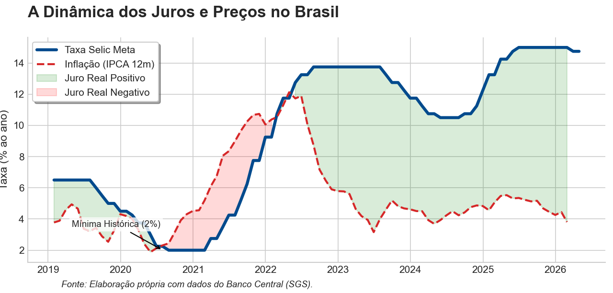

## Do porquê da variação da taxa básica

Para compreender a necessidade constante de ajustes na taxa básica de juros (Selic) observada na realidade brasileira, é necessário primeiro compreender a função do Banco Central do Brasil (BCB) e da própria Selic.

O BCB tem como uma de suas atribuições assegurar a estabilidade do valor da moeda e do sistema financeiro nacional. O mecanismo através do qual garante essa estabilidade é a Taxa Selic, a taxa básica de juros, servindo como base para as demais taxas da economia: na prática, impacta os valores de financiamento de automóveis, o rotativo do cartão de crédito e o rendimento da poupança.

::: callout-note
"Tá, mas e a Economia? - Taxa Selic

A Selic Meta, ou seja, o valor alvo para a taxa de juros brasileira, é definida pelo Banco Central do Brasil através das reuniões do Comitê de Política Monetária (Copom), o qual é composto pelos membros da Diretoria Colegiada do Banco Central do Brasil, entre eles o Presidente do BCB e mais oito diretores. Na prática, ela é definida no mercado de títulos, através de diferentes instrumentos, cabendo ao BCB atuar por meio de operações open market para garantir que a taxa convirja para a meta estipulada.
:::

## Da explicação dos constantes cortes e aumentos dos juros

Segundo a teoria econômica, há uma taxa real de referência de longo prazo. Entretanto, a economia está sob constantes choques internos e externos, como conflitos geopolíticos e recessões. Assim, o BCB vê a necessidade de adotar maior flexibilidade, ajustando constantemente a taxa básica com intuito de manter estabilidade (da moeda e do sistema financeiro) e valendo-se de metas de curto prazo para a inflação (12 ou 24 meses).

::: callout-note
"Tá, mas e a Economia? - Taxa real de referência de longo prazo

A taxa real de referência de longo prazo (r\*) de uma economia é a taxa real no equilíbrio, no qual a poupança total iguala-se ao investimento agregado, garantindo pleno emprego dos recursos (ainda que haja o desemprego natural) sem gerar pressões inflacionárias. Por ser uma variável que exerce influência sem que possa ser medida ou observada diretamente no mercado financeiro, ela é estimada econometricamente a fim de isolar as tendências dos ciclos econômicos de curto prazo. De tal estimativa, o Copom obtém base para subir ou reduzir a Selic Meta comparando a taxa vigente com r\*. Por exemplo, em um cenário no qual a inflação está acima da meta, o juro é elevado acima de r\* para desestimular a demanda.
:::

Abaixo, observa-se com mais clareza os ciclos de diminuição e incremento na taxa Selic:

{width="100%" style="margin: 20px 0;"}

Em 2020, para evitar um colapso devido à pandemia, o BCB definiu a Selic Meta em 2% ao ano. O objetivo era baratear o crédito para estimular o consumo das famílias e o investimento produtivo das empresas. Além disso, foi gerado, a partir dessa política, um forte efeito cambial, contribuindo para a desvalorização do Real, impactando a dinâmica de exportações, aumentando a competitividade de produtos brasileiros no exterior, e dos custos de insumos importados, que se tornaram mais caros para o mercado doméstico. Tudo com o objetivo de manter o capital circulando enquanto o país enfrentava fortes restrições sanitárias.

No entanto, esse estímulo monetário trouxe desafios complexos. Com a Selic em patamares tão baixos, o diferencial de rentabilidade entre o Brasil e o exterior reduziu-se drasticamente, o que provocou uma saída de capitais estrangeiros e pressionou o câmbio.

A desvalorização da moeda brasileira somada aos choques de oferta globais, como a desarticulação das cadeias produtivas e a alta das *commodities*, gerou uma forte inflação de custos. Entre 2020 e 2021, o IPCA acelerou rapidamente, superando os juros nominais e forçando o Banco Central a iniciar um ciclo agressivo de elevação da taxa para 13,75%, visando ancorar novamente as expectativas de mercado.

::: callout-note
"Tá, mas e a Economia? - Juro Real e a Equação de Fisher

Diferente do juro nominal (a taxa Selic anunciada), o juro real mede o ganho efetivo de uma aplicação ou o custo real de um empréstimo, já descontada a inflação do período. Ele representa a variação do poder de compra.

Na Equação de Fisher, se utilizarmos a expectativa de inflação (Focus), obtemos o juro real *ex-ante*, que orienta as decisões de investimento e política monetária. Se utilizarmos a inflação realizada (IPCA), obtemos o juro real *ex-post*, que mensura a variação efetiva do poder de compra no passado. Para calcular o juro real de forma precisa, utilizamos a relação multiplicativa entre as taxas: **(1+r) = (1+ i) / (1 + π)**. Sendo r = taxa de juros real; i = taxa de juros nominal; π = inflação (IPCA).
:::

Após uma rápida tentativa de queda em 2024, incertezas fiscais e uma nova pressão inflacionária forçaram o BCB a manter a precaução. Na prática, isso significa que o Banco Central do Brasil continua mantendo o crédito caro para garantir que a inflação não volte a subir, mesmo que isso signifique um crescimento mais lento no curto prazo.

## Perspectiva de cortes no Brasil e possíveis impactos

Antes do recente conflito no Irã, o cenário para a economia brasileira projetava uma trajetória de queda de juros mais rápida e otimista. Os indicadores de inflação no Brasil vinham apresentando um arrefecimento constante, com as medidas mais estáveis de preço e o setor de serviços em moderação.

Essa dinâmica era sustentada por um câmbio mais valorizado e o comportamento favorável das commodities no mercado internacional, ajudando a segurar os níveis de preços, uma vez que um câmbio mais forte barateia a importação de insumos industriais e bens de consumo, enquanto a queda das commodities reduz diretamente os custos de produção de alimentos e energia.

Naquele momento, a perspectiva de cortes mais robustos na Selic era alimentada pela convergência gradual da inflação em direção à meta e pela moderação do Produto Interno Bruto, sinalizando que o excesso de demanda estava sendo drenado pelo rigor da política monetária.

Entretanto, o cenário global impôs mudanças significativas, elevando a incerteza. Com o agravamento das tensões geopolíticas e as novas dúvidas sobre a condução da política econômica nos Estados Unidos, o otimismo deu lugar a uma postura de cautela, fazendo com que os cortes da Selic Meta fossem menores que os inicialmente esperados.

Esse novo ambiente trouxe riscos de alta significativos para os preços domésticos, especialmente pela possibilidade de um dólar persistentemente mais caro e pela resiliência da inflação de serviços, que ainda responde a um mercado de trabalho com desemprego em patamares historicamente baixos.

Diante dessa conjunção de fatores, o que se desenhava como um ciclo de quedas expressivas transformou-se em um processo mais paulatino. Essa estratégia visa proteger o país da volatilidade externa e de um choque dos preços do petróleo, além de garantir que o esforço feito para controlar a inflação não seja perdido.

## Motivação do BCB para o ajuste dos juros para 14,75%

Após um longo período de manutenção da taxa de juros alta, o BCB iniciou um movimento de descida: a Selic agora está em **14,75% a.a.** Embora a redução tenha sido de apenas 0,25%, ela marca o que a mídia tem denotado como "um novo ciclo de cortes".

O Copom reconheceu que a atividade econômica brasileira começou a apresentar a desaceleração esperada no final de 2025, um reflexo do período prolongado de juros altos. Entretanto, tornou-se necessário uma alteração mais sutil da Selic Meta, a fim de não restringir a economia além do necessário, dado os efeitos dos juros sobre a economia.

Outro ponto de atenção é a resiliência do mercado de trabalho. Com o desemprego em níveis baixos e salários subindo, a inflação de serviços torna-se mais difícil de combater. Na prática, o BCB começou a aliviar o peso sobre os juros, mas manterá o caráter restritivo da política monetária pelo tempo que for necessário para garantir que a inflação não volte a subir.

::: callout-tip
#### ODS 16 — Paz, justiça e instituições eficazes

O texto aborda o conceito de instituições eficazes ao explicar o papel de um Banco Central na economia. A independência do BCB e a transparência do Copom em suas decisões exemplificam como instituições sólidas contribuem para a estabilidade econômica e para o bem-estar da população.
:::

**Transparência em Uso de IA:** Foram utilizados Google Gemini (para geração do código do gráfico) e Deepseek e Gemini (para correção ortográfica dos textos).

**Para saber mais:**

BANCO CENTRAL DO BRASIL. Comitê de Política Monetária. *Ata da 277ª Reunião do Copom: 17 e 18 de março de 2026*. Brasília, DF: Banco Central do Brasil, 2026. Disponível em: <https://www.bcb.gov.br/content/copom/atascopom/Copom277-not20260318277.pdf>. Acesso em: 5 abr. 2026.

MANKIW, N. G. Inflação: causas, efeitos e custos sociais. *In*: MANKIW, N. Gregory. **Macroeconomia**. 10. ed. São Paulo: Atlas, 2021. cap. 5, p. 114-119.

::: botoes-fim-de-pagina
[Voltar para a Newsletter](indexNe.qmd){.btn-voltar}

[Ler o próximo texto](Estilo7.qmd){.btn-proximo}
:::
