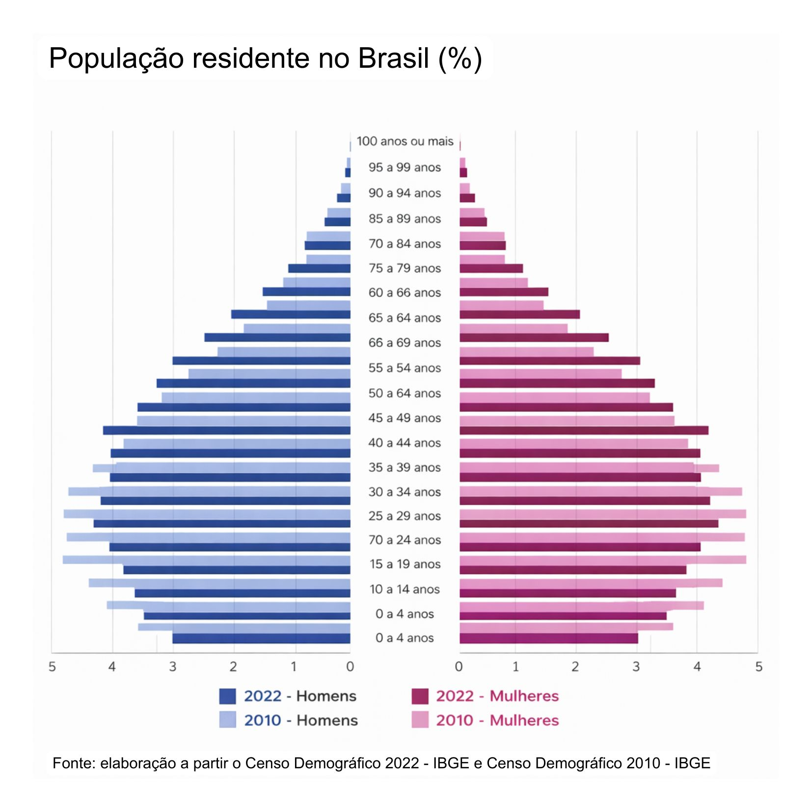

## Um país que está ficando mais velho

A tradicional imagem do Brasil como uma nação de estrutura majoritariamente jovem já ficou no passado. A pirâmide populacional brasileira, que historicamente possuía uma base larga, vem encolhendo rapidamente. Essa transição demográfica é o resultado direto de dois fatores: as famílias diminuíram (a fecundidade caiu de 6,2 filhos por mulher em 1950 para 1,5 em 2022, segundo o IBGE) e a expectativa de vida aumentou, saltando de 54 para 76 anos, de acordo com o Banco Mundial.

{width="65%" style="display: block; margin: 20px auto;"}

Para se ter uma ideia, a França levou quase um século e meio para absorver e se adaptar ao aumento de sua população idosa; o Brasil precisará lidar com esse mesmo salto em cerca de 25 anos. Com projeções do IBGE indicando que mais de um quarto dos brasileiros terá mais de 60 anos até 2060, isso deixa de ser apenas um dado demográfico e passa a impactar diretamente a economia.

::: caixinha-lateral-esq
"Tá, mas e a Economia? - Transição demográfica

É a mudança no perfil populacional de uma sociedade. A queda da natalidade, combinada à menor mortalidade e ao aumento da longevidade, desacelera o crescimento populacional e leva ao envelhecimento da população.
:::

## O fim do bônus demográfico

Nas últimas décadas, o Brasil surfou na onda favorável do chamado bônus demográfico. Na prática, isso significava mais gente trabalhando do que dependendo da renda gerada pela população em idade ativa. O resultado foi direto: com uma força de trabalho expressiva gerando riqueza, o peso da dependência caiu, abrindo caminho para a poupança, o investimento e a expansão econômica.

Mas essa janela de oportunidade está se fechando rápido. Com o envelhecimento acelerado do país, a População Economicamente Ativa (PEA) perdeu o fôlego de crescimento e já começa a dar sinais de encolhimento.

O impacto imediato dessa virada é o fim daquele crescimento econômico "fácil". A demografia deixou de ser um fator a favor, e o país agora precisa construir esse crescimento.

::: caixinha-lateral-dir
"Tá, mas e a Economia? - Bônus demográfico

Período em que a proporção de pessoas em idade ativa (entre 15 e 64 anos) é significativamente maior do que a de dependentes (crianças e idosos), favorecendo a capacidade de produção, a geração de renda e o crescimento econômico do país. Quando essa estrutura começa a se inverter, com o envelhecimento da população e a redução relativa da força de trabalho, a contribuição do fator trabalho para a economia diminui, o que tende a frear o crescimento do PIB e da produtividade, já que há menos pessoas produzindo, inovando e sustentando o ritmo de expansão econômica.
:::

## O impacto no crescimento econômico

Com a redução do número de pessoas disponíveis para trabalhar, não apenas a manutenção do crescimento econômico é desafiada, mas a conta da Previdência Social deixa de fechar com a mesma facilidade de antes. A explicação para isso tem bases na teoria tradicional: modelos teóricos de crescimento econômico mostram que a expansão de um país depende da engrenagem combinada entre trabalho, capital e tecnologia. Se a peça do "trabalho" encolhe por causa do envelhecimento da população, o ritmo de expansão da produtividade e do PIB tende a frear junto.

No Brasil, os reflexos dessa virada já começam a aparecer no mercado de trabalho. Com a escassez de jovens profissionais, a fatia de trabalhadores mais velhos na ativa vai dar um salto considerável. Na prática, isso obriga as empresas a mudarem suas rotinas para reter e adaptar os ambientes a esse grupo. Essa retenção não é apenas um debate sobre o futuro da previdência, mas uma resposta urgente e necessária para manter o país crescendo diante de uma prateleira mais vazia de mão de obra.

O problema, portanto, não é apenas ter mais idosos. É saber se a economia brasileira está em condições de sustentar esse novo perfil populacional, especialmente diante dos impactos sobre o mercado de trabalho, a produtividade e o financiamento das contas públicas.

::: caixinha-lateral-esq
"Tá, mas e a Economia? - Modelo de Solow

Desenvolvido por Robert Solow nos anos 1950, o modelo é um dos principais pontos de partida da teoria do crescimento econômico. Ele explica o crescimento a partir de três fatores centrais: capital, trabalho e tecnologia. O modelo mostra que, na ausência de progresso tecnológico, a economia tende a desacelerar e atingir um ponto de equilíbrio (estado estacionário), devido aos retornos decrescentes do capital. Assim, o crescimento sustentado da renda por trabalhador depende de avanços tecnológicos.
:::

## A questão estrutural

A economia do Brasil convive há décadas com baixa produtividade, crescimento irregular e um mercado de trabalho marcado pela informalidade. Segundo a FGV Ibre, nos 30 anos entre 1995 e 2025, a produtividade cresceu 30%, menos de 1% por ano. Nesse contexto, com menos gente trabalhando, o crescimento passa a depender menos de quantidade e mais de eficiência.

A literatura econômica indica que o envelhecimento populacional afeta a dinâmica econômica tanto pelo lado da demanda quanto da oferta, especialmente pela redução relativa da população em idade ativa. Esse processo tende a impactar a produção e o emprego, com efeitos diferenciados entre setores, sobretudo aqueles mais intensivos em trabalho, a menos que seja compensado por ganhos de produtividade e mudanças na estrutura produtiva.

No caso brasileiro, o desafio é duplo: além de produzir mais com menos gente, o país ainda convive com uma fatia expressiva de trabalhadores na informalidade, que contribuem pouco ou nada para a arrecadação. Isso significa que o envelhecimento não apenas reduz quem produz, mas também reduz quem financia os sistemas públicos que sustentam a população mais velha.

Sem avanços relevantes em produtividade, educação e formalização, o país entra em uma nova fase demográfica carregando velhos entraves econômicos. No fim, o envelhecimento funciona como um amplificador: ele não cria os problemas estruturais do Brasil, mas os torna mais urgentes e mais difíceis de ignorar.

## Previdência: quem vai pagar a conta?

Se os entraves econômicos já dificultam o crescimento, o envelhecimento adiciona uma pressão ainda mais direta sobre o Estado. Com mais brasileiros se aposentando e vivendo por mais tempo, os gastos públicos com previdência e saúde crescem de forma acelerada.

O Brasil adota o regime de repartição simples e o envelhecimento populacional está colocando esse modelo sob pressão crescente. E diferentemente dos desafios de produtividade, que podem ser enfrentados com políticas de longo prazo, o desequilíbrio previdenciário tem prazo de vencimento: a cada ano que passa, há mais aposentados e menos contribuintes na fila. O resultado já aparece nos números: o déficit previdenciário já somava **R\$444,1 bilhões** no acumulado até fevereiro de 2026, cerca de 3,4% do PIB, segundo o Tribunal de Contas da União.

A Reforma da Previdência de 2019 foi uma resposta a esse cenário, adiando aposentadorias e aumentando o tempo de contribuição. Comprou tempo, mas não resolveu a questão estrutural. Reformas pontuais funcionam como remendos num sistema que, sem mudanças mais profundas, continuará pressionando as finanças públicas por décadas.

O governo precisará escolher entre aumentar impostos, cortar benefícios ou reformar novamente as regras. Enquanto essa resposta não vem, o rombo cresce e o espaço para investir em outras áreas, como educação e infraestrutura, vai se estreitando junto.

::: caixinha-lateral-dir
"Tá, mas e a Economia? - Regimes previdenciários

**Regime de repartição simples (modelo do Brasil):** As contribuições dos trabalhadores ativos de hoje não são guardadas para o futuro de cada um, mas utilizadas diretamente para pagar os benefícios de quem já se aposentou. O sistema depende de um equilíbrio constante entre quem contribui e quem recebe. Com o envelhecimento, há menos trabalhadores para sustentar um número crescente de idosos, o que desequilibra a balança.

**Regime de capitalização:** Funciona como uma poupança individual, aos moldes dos planos de pensão privados. O dinheiro que o trabalhador contribui vai para uma conta própria, investida para financiar a sua própria velhice, não dependendo de um equilíbrio com as gerações futuras.
:::

Envelhecer é inevitável, mas o despreparo não precisa ser. O Brasil já conhece os desafios que virão, com mais idosos, menos contribuintes e uma economia ainda marcada por problemas antigos. O ponto central é decidir se o país vai se antecipar a essa transição ou apenas reagir quando a pressão aumentar. Ainda há tempo, mas não é infinito.

::: callout-tip
#### ODS 8 — Trabalho Decente e Crescimento Econômico

Esse tema se conecta ao ODS 8, que promove um crescimento sustentado, inclusivo e baseado em empregos de qualidade, em linha com o desafio discutido: avançar em produtividade e inclusão diante do envelhecimento populacional.
:::

**Transparência em Uso de IA:** Ferramentas: ChatGPT-4 e Claude. Uso: organização das ideias e revisão gramatical. Todo o conteúdo foi revisado pelas autoras, que assumem responsabilidade pela versão final.

**Para saber mais:**

FOCHEZATTO, A.; CORREA PETRY, G.; BRAATZ, J.; MARTINEZ, P. M.; DA ROCHA, M. M. Envelhecimento populacional e financiamento público: análise do Rio Grande do Sul utilizando um modelo multissetorial. *Revista Brasileira de Estudos de População*, v. 37, p. 1–24, 2020. DOI: 10.20947/S0102-3098a0128. Disponível em: <https://rebep.org.br/revista/article/view/1433>.

::: botoes-fim-de-pagina
[Voltar para a Newsletter](indexNe.qmd){.btn-voltar}

[Ler o próximo texto](Estilo8.qmd){.btn-proximo}
:::
