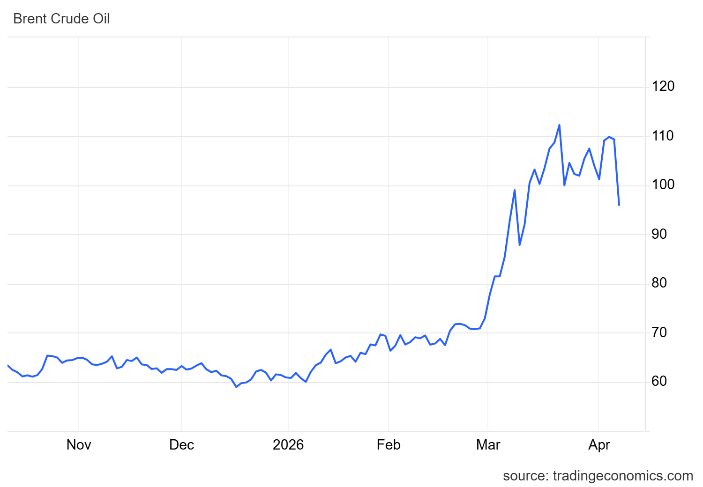

## As consequências da guerra

Após o ataque israelense e estadunidense ao Irã, em 28 de fevereiro de 2026, os efeitos da continuidade da guerra vêm se espalhando pela economia mundial a cada dia. Em março, o preço do petróleo bruto Brent, referência internacional, superou a marca de **US\$ 115 por barril**, atingindo o maior nível desde 2012 e acumulando alta de cerca de 57% em relação ao valor da véspera do ataque, quando girava em torno de US\$ 70 por barril. Esse forte aumento decorre principalmente do bloqueio iraniano ao estreito de Ormuz, adotado como represália, por onde passa cerca de **20% de todo o petróleo e gás** comercializados no mundo.

Fenômenos dessa natureza não são inéditos. Situações semelhantes ocorreram nos choques do petróleo de 1973 e 1979, quando elevações abruptas no preço do petróleo provocaram impactos significativos na economia global, combinando inflação elevada com desaceleração da atividade econômica e, em muitos casos, resultando em recessões. Esses episódios históricos ajudam a entender por que novos choques no mercado de petróleo geram tanta preocupação entre governos, empresas e famílias.

::: callout-note
"Tá, mas e a Economia? - Como funciona o mercado internacional de petróleo

O mercado internacional do petróleo cru, como o Brent, funciona basicamente como um mercado global de compra e venda de uma commodity padronizada, cujo preço é determinado pela interação entre oferta e demanda mundial. O Brent é uma referência mundial para o preço do petróleo. Quando ele sobe, indica que os combustíveis ficam mais caros.
:::

{width="100%" style="margin: 20px 0;"}

Contudo, esse efeito nos preços não fica restrito aos combustíveis, uma vez que os efeitos dos aumentos de preço vão se acumulando. Imagine uma confeitaria que vende um bolo simples por 20 reais. Nesse cenário de aumento do preço do petróleo, o mesmo bolo passaria a ter um valor de venda mais elevado. Isso porque a gasolina mais cara encarece o transporte de mercadorias, o que eleva o custo das matérias-primas e do frete, que representam parte importante dos custos logísticos no Brasil.

Quando a confeiteira vai ao mercado comprar os ingredientes e percebe esse aumento em seus preços, ela pode tentar reajustar o valor do bolo para preservar sua margem de lucro. No entanto, esse repasse de custos não é garantido. A capacidade de aumentar preços depende das condições do mercado e da reação dos consumidores.

Em mercados com muitos vendedores e produtos semelhantes, como em situações próximas à concorrência perfeita, aumentar preços pode significar perder clientes. Já em mercados com menos concorrentes ou produtos diferenciados, como em monopólios ou oligopólios, há mais espaço para reajustes.

::: callout-note
"Tá, mas e a Economia? - Elasticidade e repasse de custos

O repasse de custos aos preços depende da elasticidade-preço da demanda, ou seja, de quanto os consumidores reagem a aumentos de preço. Quando a demanda é elástica, aumentos de preço reduzem significativamente a quantidade demandada, dificultando o repasse. Já quando a demanda é inelástica, o consumo varia pouco, o que facilita o repasse.
:::

Ou seja, o aumento no valor do bolo representa a **inflação de custos**: quando produzir e transportar mercadorias fica mais caro, esse encarecimento pode se espalhar pela cadeia produtiva até chegar ao consumidor final, dependendo da capacidade de repasse das empresas.

::: callout-note
"Tá, mas e a Economia? - Inflação

Inflação é o aumento médio no nível de preços de determinada cesta de produtos e serviços. O índice de inflação mais comum no Brasil é o IPCA, que hoje está por volta de 3,8% nos últimos 12 meses.
:::

## Aprofundando a ideia de choque

A partir do cenário recente envolvendo o conflito com o Irã, conseguimos perceber como os agentes econômicos estão constantemente sujeitos a mudanças. Esse tipo de evento ajuda a entender por que a economia é tão dinâmica, já que ela é frequentemente impactada por *choques econômicos* — acontecimentos inesperados que afetam diversos setores ao mesmo tempo.

De forma geral, os choques podem ser classificados de acordo com a maneira como afetam a economia, seja pelo lado da oferta ou da demanda. Além disso, seus efeitos não acontecem apenas no momento inicial, pois se desdobram ao longo do tempo por respostas dos agentes ao choque, que impactam o produto e outros indicadores. Esse processo é conhecido como **propagação do choque**.

Dependendo da intensidade, esses efeitos podem se ampliar e gerar consequências mais sérias, como queda na produção e até uma recessão. Retomando o exemplo da confeitaria, em que houve aumento de custos e dificuldade na produção, conseguimos conectar esse cenário diretamente aos efeitos do conflito recente — levando a analisar um tipo específico: o choque de oferta.

::: callout-note
"Tá, mas e a Economia? - Choque na Economia

Um choque de oferta ocorre quando há mudanças na capacidade de produção da economia. Ele pode ser temporário ou permanente. No curto prazo, choques temporários afetam principalmente os custos de produção, como no caso da alta do petróleo, que encarece transporte e insumos. Já no longo prazo, choques permanentes alteram a própria capacidade produtiva, como ocorre em guerras, desastres naturais ou destruição de infraestrutura, que reduzem estoques de capital e comprometem a produção futura.
:::

No contexto atual, isso pode ser observado a partir das tensões envolvendo o Irã, que afetam diretamente o mercado global de petróleo. Quando esse choque é negativo, a economia passa a produzir menos, ao mesmo tempo em que os preços sobem. Em termos mais visuais, é como se a oferta agregada encolhesse.

No cenário atual, as restrições à oferta de petróleo elevam seus preços e aumentam os custos de produção em diversos setores, gerando um efeito em cadeia semelhante ao observado no exemplo da confeiteira. Assim, o aumento de preços não ocorre de forma isolada, mas se espalha por toda a economia.

## Políticas de contenção

Em resposta a esse choque na economia, o governo brasileiro já tomou algumas medidas. No contexto da **política monetária**, o presidente do Banco Central, Gabriel Galípolo, restringiu o espaço para a redução da taxa básica de juros, mantendo-a no ainda elevado patamar de 14,75%, devido ao aumento da expectativa de inflação. Essa volatilidade dificulta o objetivo do BCB de atingir a meta inflacionária, "esfriando" a economia e diminuindo o efeito nos outros setores.

Já na **política fiscal**, para mitigar a inflação do petróleo e no resto da economia, o governo federal realizou medidas para evitar esse problema:

-   Subvenção de R\$ 0,32 por litro para produtores e importadores de diesel
-   Zeragem das alíquotas federais PIS/Cofins sobre a importação e comercialização do óleo diesel, o que diminui o custo por litro e tende a diminuir o preço final ao consumidor
-   Isenção de impostos sobre o biodiesel

Além disso, para compensar a receita perdida, o governo aumentou a tributação sobre exportações de petróleo. O efeito visado dessas medidas é uma diminuição da pressão inflacionária nos combustíveis e, por consequência, nos demais setores da economia brasileira.

::: callout-tip
#### ODS 13 — Ação contra a mudança global do clima

O aumento no preço dos combustíveis fósseis pode levar as pessoas a mudarem cada vez mais seus meios de locomoção, optando por transportes públicos ou veículos híbridos e/ou elétricos, contribuindo indiretamente para a redução de emissões de carbono.
:::

**Transparência em Uso de IA:** Ferramentas: ChatGPT-4 e Gemini. Uso: organização das ideias e revisão gramatical. Todo o conteúdo foi revisado pelos autores, que assumem responsabilidade pela versão final.

**Referências:**

BLANCHARD, Olivier. *Macroeconomia*. 7. ed. São Paulo: Pearson, 2017. p. 209-210.

CHOQUE de oferta: o que é, definição e conceito. Economy-Pedia, \[s.d.\]. Disponível em: <https://pt.economy-pedia.com/11037698-offer-shock>. Acesso em: 8 abr. 2026.

CNN BRASIL. Choque da guerra atua contra espaço para corte da Selic, diz diretor do BC. Disponível em: <https://www.cnnbrasil.com.br/economia/macroeconomia/choque-da-guerra-atua-contra-espaco-para-corte-da-selic-diz-diretor-do-bc/>. Acesso em: 8 abr. 2026.

DEFINIÇÃO de choque econômico. ADM Fácil, \[s.d.\]. Disponível em: <https://www.admfacil.com/definicao-de-choque-economico/>. Acesso em: 8 abr. 2026.

::: botoes-fim-de-pagina
[Voltar para a Newsletter](indexNe.qmd){.btn-voltar}

[Ler o próximo texto](Estilo5.qmd){.btn-proximo}
:::
