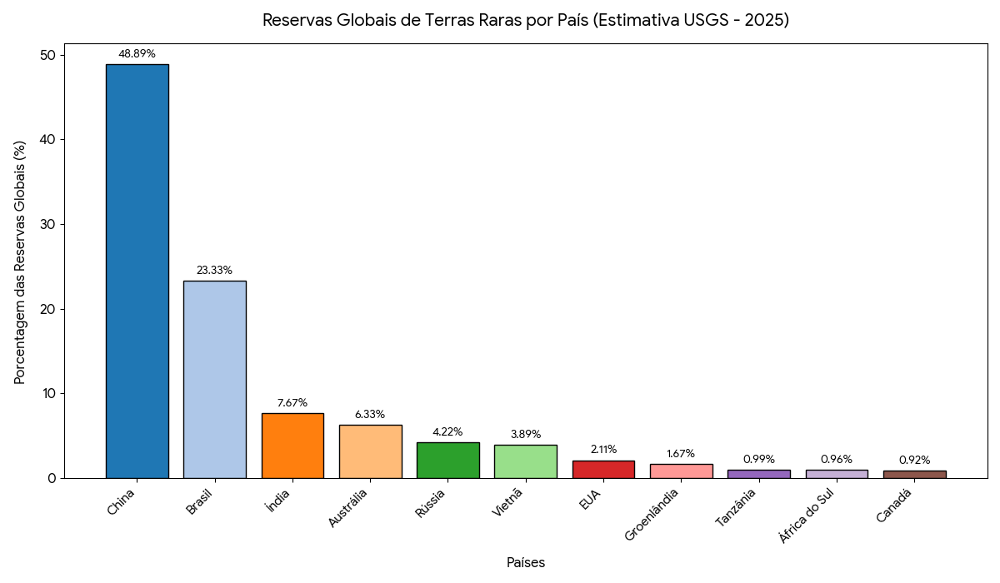

## Das terras raras

Compreende-se por terras raras o conjunto de 17 elementos metálicos (lantanídeos + escândio e ítrio) que, apesar do nome, não são geologicamente raros em abundância, mas com custos altos de extração, superando por vezes seu preço de venda. Dividem-se em leves (cério, lantânio, neodímio) e pesadas (disprósio, térbio), sendo as pesadas mais escassas e de maior valor estratégico.

Esses minerais estão presentes em turbinas eólicas, motores de veículos elétricos, smartphones, sistemas de defesa e satélites, sendo considerados como insumos críticos tanto da transição energética quanto da economia digital do século XXI.

Neodímio e praseodímio, especificamente, são utilizados para fabricação de ímãs permanentes de alta potência, peça para motores de veículos elétricos e geradores eólicos.

::: caixinha-lateral-esq
**“Tá, mas e a economia?” — Oligopólio**

O oligopólio de oferta é uma estrutura de mercado caracterizada por um pequeno número de produtores que detém o controle da maior parte ou totalidade da oferta de um bem ou serviço, em contraposição a uma grande quantidade de compradores. Diante disso, as empresas que detém a produção têm poder de mercado a ponto de influenciar preços, saindo de um cenário de concorrência perfeita.
:::

A demanda por esses minerais cresceu de forma expressiva na última década, e a expectativa é de mais crescimento à medida que governos avançam em agendas de descarbonização e digitalização. Segundo o U.S. Geological Survey (USGS), a produção mundial de terras raras atingiu cerca de 375.950 toneladas em 2023.

Para a economia, o ponto central do tema é a estrutura de mercado, pois as terras raras estão inseridas em um oligopólio de oferta chinês, justamente por a China ser a maior responsável pelo beneficiamento desses minerais.

## O mapa das reservas e da produção mundial

::: caixinha-lateral-dir
**“Tá, mas e a economia?” — Óxidos de Terras Raras (REO)**

Em economia, medir corretamente é condição para analisar preços, comparar mercados e estimar valor ao longo de cadeias produtivas.

A solução adotada pelo mercado e pelos organismos internacionais é a tonelada de REO (Rare Earth Oxide), que representa o equivalente em óxido de cada elemento. O REO funciona como um denominador comum que viabiliza comparações padronizadas entre minerais, países e períodos.
:::

As reservas mundiais de terras raras são estimadas pelo USGS em aproximadamente 90 milhões de toneladas de REO (2025). O Brasil detém cerca de 21 milhões de toneladas, representando cerca de 23% do total mundial, sendo a segunda maior reserva individual, atrás apenas da China (48%).

Em relação ao beneficiamento, estimativas do Departamento de Energia dos EUA e do Parlamento Europeu indicam que a China controla entre 85% e 90% da capacidade global de transformar terras raras brutas em compostos industrialmente utilizáveis.

{width="100%" style="margin: 20px 0;"}

## O poder de mercado da China

A hegemonia chinesa resulta de décadas de política industrial deliberada, envolvendo subsídios, criação de empresas estatais, institutos de pesquisa e patentes. Já na década de 70, o cientista Xu Guangxian desenvolveu teorias responsáveis por maior pureza na extração dos minerais. Mas, é a partir dos anos 1980, num contexto de salários reais baixos e poucas leis ambientais, que a China investe sistematicamente em capacidade de processamento mineral para consolidar vantagem competitiva ao longo de toda a cadeia produtiva desde a extração até o componente industrializado. Por conta desse conjunto de fatores, atualmente a China detém cerca de 90% do poder de processamento de terras raras, mesmo possuindo menos da metade das reservas mundiais.

Para compreender a dimensão desse poder, é preciso distinguir duas etapas da cadeia produtiva: a extração, que consiste na remoção do minério bruto da jazida, e o beneficiamento, que é o conjunto de processos físicos e químicos de separação e purificação dos elementos (por solventes, precipitação, redução metálica) que os tornam utilizáveis pela indústria. A diferença de valor entre as duas etapas é expressiva: uma tonelada de minério bruto pode render compostos finais (óxidos de alta pureza, ligas metálicas, ímãs permanentes) que valem duas, quatro ou mais vezes o preço da matéria-prima. É precisamente aí que reside o poder de mercado chinês: mesmo minerais extraídos nos EUA e na Austrália são hoje majoritariamente enviados à China para processamento, tornando a dependência estrutural não na jazida, mas na fábrica.

Em 2010, Pequim restringiu as exportações de terras raras, gerando um choque de preços global. Assim, para que EUA, União Europeia, Japão e Austrália desenvolvessem estratégias de diversificação de fornecimento e constituição de estoques estratégicos. A OMC julgou as restrições chinesas ilegais em 2014.

O resultado desse oligopólio tem implicações que extrapolam o mercado de commodities, como preços altos, por conta de uma maior mark-up (devido ao contexto de oligopolização), e maior poderio chinês sobre negociações globais. De tal forma que quem controla o beneficiamento das terras raras controla, em última instância, as cadeias de valor da eletrônica, da mobilidade elétrica e dos sistemas de defesa.

## Da negociação da Serra Verde

É nesse cenário que se insere a compra da mineradora brasileira Serra Verde (completamente estruturada por capital estrangeiro) pela americana USA Rare Earth (USAR), anunciada em abril de 2026. A operação, avaliada em cerca de **US\$ 2,8 bilhões**, sendo US\$ 300 milhões em dinheiro e o restante em ações da compradora, transfere totalmente o controle da Serra Verde, dona da mina Pela Ema, em Minaçu (GO), único produtor ativo de terras raras no Brasil.

A transação integra uma estratégia mais ampla dos Estados Unidos de manter sua hegemonia geopolítica frente à China, visto que o Brasil, sob a ótica estadunidense, reúne atributos estratégicos evidentes como magnitude das reservas, estabilidade institucional e ausência de uma indústria de beneficiamento doméstico de terras raras consolidada.

::: caixinha-lateral-esq
**“Tá, mas e a economia?” — Barreiras de entrada**

As barreiras de entrada são a dificuldade que novas empresas têm em entrar em um mercado. Neste caso, vale citar tecnologia de processamento, custos ambientais, regulatórios e de construção de uma mina. Em outras palavras, a principal barreira de entrada é a necessidade de alto capital inicial, com retornos apenas no longuíssimo prazo.
:::

Do ponto de vista da teoria econômica, a extração de terras raras enfrenta altas barreiras de entrada, gerando oligopólio de oferta. Por conta disso, em todas as principais nações atuantes no mercado de terras raras, o Estado investe fortemente, já que é o principal agente da economia a dispor de capital paciente em um contexto de fortes externalidades positivas (segurança nacional e viabilização de indústrias de alto valor agregado). Isto é, para superar os altos custos de extração de terras raras, houveram anos de política industrial chinesa e, no caso dos EUA, a própria compra da Serra Verde foi financiada por um banco estatal americano. Mesmo a MP Materials, responsável por explorar a única fonte ativa de terras raras dos Estados Unidos, na Califórnia, opera sob parceria público privada com o departamento de defesa.

Com isso em vista, houve a proposta de criação, pela União, de uma empresa estatal de terras raras, a Terrabras. Uma empresa brasileira que seria a responsável pela exploração desses minerais, assim como ocorre com a Petrobras em relação ao petróleo. Dentro do contexto citado, o capital financiado pelo Estado tem uma importância que pode ser descrita pelo conceito de **capital paciente**: como os investidores, usualmente, buscam retorno sobre investimento em prazos previsíveis e com menor risco, e como os projetos de mineração e refino de terras raras exigem bilhões de dólares e levam anos apenas entre o licenciamento e o início da produção, surge a necessidade de recursos de longo prazo que toleram o risco extremo e a ausência de lucro imediato.

## As consequências negativas do acordo

A teoria do comércio internacional corrobora e atesta o acordo firmado, mas desconsidera dois fenômenos centrais identificados pela literatura: as externalidades positivas da industrialização (aprendizado, transbordamentos tecnológicos, economias de escala dinâmicas) e a assimetria de poder em mercados oligopolizados, nos quais os ganhos do comércio são capturados desproporcionalmente pelo agente dominante. É exatamente o caso das terras raras.

A controvérsia em torno do contrato de cessão não está necessariamente no valor da venda, mas nas condições que deixaram de ser impostas. Em nenhum momento a negociação exigiu que o beneficiamento das terras raras extraídas ocorresse em território nacional.

Manter o beneficiamento no Brasil significaria geração de emprego para mão de obra altamente qualificada, transferência de tecnologia, receita fiscal adicional e, em última instância, acumulação de capacidade produtiva em um setor de fronteira tecnológica.

::: caixinha-lateral-dir
**“Tá, mas e a economia?” — Teoria do Comércio Internacional**

A teoria clássica do comércio internacional, na formulação ricardiana, recomendaria ao Brasil especializar-se na atividade econômica em que possui vantagem comparativa frente a outras nações (a extração mineral) e importar os produtos industrializados de maior valor.
:::

É nesse aspecto teórico que se inserem as cláusulas de conteúdo local (LCR). Do ponto de vista da teoria do comércio estratégico (Brander, 1985), em mercados não competitivos, a intervenção estatal pode deslocar rendas do produtor estrangeiro para o doméstico. As LCR (exigências contratuais ou regulatórias que determinam uma proporção mínima de valor agregado gerada no país de origem do recurso) são esse instrumento. Indonésia (níquel e bauxita) e Austrália já as aplicam para minerais estratégicos, forçando empresas estrangeiras a investir em capacidade industrial local como condição de acesso às reservas. O Brasil utiliza mecanismos análogos na produção de petróleo via ANP, mas ainda não transpôs essa lógica para as terras raras. Adotar tal medida, passando a exigir transferência de tecnologia para o território brasileiro, pode ser uma forma de resolver as consequências negativas do acordo.

::: callout-tip
#### ODS 9 — Indústria, inovação e infraestrutura

Esse tema se conecta ao ODS 9, ao tratar de países em desenvolvimento transitando da exportação de commodities brutas para a geração doméstica de valor agregado industrial e tecnológico. Esse movimento, ou a sua ausência, está no centro do debate sobre as terras raras brasileiras.
:::

**Transparência em Uso de IA:** Ferramentas: Gemini, Notebook LM e Claude. Uso: geração de código em Python para construção do gráfico, busca de fontes de pesquisa adequadas e revisão gramatical. O conteúdo foi integralmente revisado pelos autores, que assumem responsabilidade pela versão final.

**Referências:**

U.S. GEOLOGICAL SURVEY. *Mineral Commodity Summaries 2024: Rare Earths*. Reston: USGS, 2024. Disponível em: <https://pubs.usgs.gov/periodicals/mcs2024/mcs2024-rare-earths.pdf>.

AGÊNCIA NACIONAL DE MINERAÇÃO (ANM). *Anuário Mineral Brasileiro 2022*. Brasília: ANM, 2022. Disponível em: <https://www.gov.br/anm/pt-br/assuntos/economia-mineral/publicacoes/anuario-mineral/anuario-mineral-brasileiro/PreviaAMB2022.pdf>.

::: botoes-fim-de-pagina
[Voltar para a Newsletter](indexNe.qmd){.btn-voltar}

[Ler o próximo texto](Estilo11.qmd){.btn-proximo}
:::
