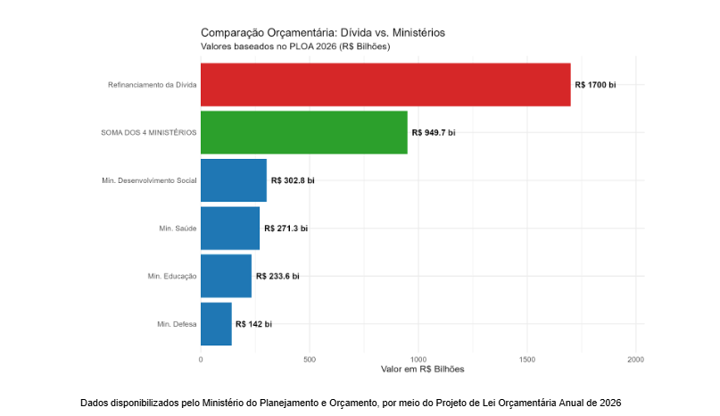

No Brasil, a condução da política monetária é responsabilidade do Banco Central, que utiliza a taxa Selic como principal instrumento operacional dentro do regime de metas de inflação. A meta e suas bandas de tolerância são definidas pelo Conselho Monetário Nacional, enquanto o Comitê de Política Monetária (Copom) decide o nível da taxa básica com o objetivo de conduzir a inflação em direção ao valor estabelecido e ancorar as expectativas dos agentes econômicos. Esse regime funciona como âncora nominal da economia e é central para a credibilidade da política econômica.

::: callout-note
**“Tá, mas e a economia?”**

**Selic + Instrumentos Política Monetária**

A política monetária atua por meio de três instrumentos principais: open market, redesconto e depósito compulsório. O open market consiste na compra e venda de títulos públicos pelo Banco Central para regular a quantidade de dinheiro em circulação. O redesconto corresponde a empréstimos de curto prazo aos bancos para garantir liquidez, enquanto o depósito compulsório é a parcela dos depósitos que as instituições financeiras devem manter retidos, o que garante a liquidez mínima para evitar que o sistema financeiro quebre.

A taxa Selic funciona como a taxa básica de juros da economia e orienta o custo do crédito e o retorno das aplicações financeiras, servindo como o principal canal de transmissão da política monetária para a atividade econômica.
:::

Em economias caracterizadas por elevada desigualdade estrutural, como a brasileira, os custos de curto prazo associados à política monetária restritiva tendem a recair de forma mais intensa sobre os grupos vulneráveis, enquanto os ganhos decorrentes da estabilidade de preços são apropriados de forma desigual.  

Nesse sentido, o problema central deste texto consiste em analisar como juros elevados tendem a favorecer rentistas e detentores de títulos públicos, enquanto ampliam o desemprego, restringem o consumo e elevam o custo do endividamento das camadas mais vulneráveis da população. Em economias marcadas por elevada desigualdade estrutural, como a brasileira, as alterações na taxa de juros tendem a produzir impactos assimétricos entre diferentes grupos sociais.

**Rentistas**

Em primeira análise, vamos entender como a Selic influencia a rentabilidade dos ativos financeiros ligados aos juros da economia, como títulos públicos e aplicações de renda fixa. Quando a Selic sobe, esses investimentos passam a render mais, o que favorece as pessoas que já têm recursos aplicados. Acontecendo quase automaticamente, sem depender de maiores esforços produtivos.

O problema é que grande parte da população não possui esse tipo de ativo financeiro. Para muitas famílias, quase todo o salário é usado para despesas básicas, como alimentação, moradia e transporte, sobrando pouco ou nada para poupar e investir. Assim, enquanto a menor parcela que já tem patrimônio vê sua renda crescer com os juros mais altos, enquanto a maioria fica fora desses ganhos.

 Em um contexto de elevada concentração da riqueza financeira, como o brasileiro, esse canal reforça a apropriação desigual dos ganhos associados à elevação da taxa de juros, beneficiando desproporcionalmente indivíduos e instituições com maior capacidade de poupança e acesso aos mercados financeiros.

**Dívida pública**

Assim, as alterações na taxa de juros básica impactam diretamente a população e reforçam mecanismos de concentração de renda. No entanto, existem canais pelos quais o impacto dessa alteração é indireto, como é o caso da dívida pública.

A dívida pública brasileira é composta por títulos emitidos pelo Tesouro Nacional. Esses títulos podem ser indexados de maneiras distintas, como atrelados 

à Selic, ao IPCA ou prefixados. 

::: lead

:::

::: callout-note
**“Tá, mas e a economia?”**

O custo da manutenção da dívida, em parte, corresponde ao custo de rolagem da dívida, termo que indica a renovação ou extensão do prazo de pagamento de débitos existentes. A rolagem da dívida ocorre por meio da emissão de novos títulos para pagar os antigos, nessa situação, juros mais altos fazem com que novos títulos sejam mais custosos aos cofres públicos, pressionando o orçamento.

Uma parcela elevada do orçamento público é composta por despesas obrigatórias, como é o caso do serviço da dívida. Por sua natureza rígida, essas despesas apresentam baixa flexibilidade no curto prazo, limitando a capacidade do governo de ajustar o orçamento. Logo, um aumento dos juros intensifica a rigidez orçamentária, gerando uma pressão sobre as demais despesas do orçamento.
:::

Como visto no gráfico, cerca de 47% da dívida pública federal é composta por títulos indexados à taxa Selic. Sendo assim, um aumento da Selic faria com que o custo de manutenção da dívida aumentasse. Segundo Sérgio Goldenstein, ex-chefe do Departamento de Mercado Aberto do Banco Central, um aumento de 1 ponto percentual da Selic gera um impacto de R\$ 37,5 bilhões ao longo de 1 ano.

Como é possível ver a partir do gráfico acima, o valor dos ministérios somados, ainda teríamos um valor menor que o destinado para refinanciamento da dívida pública. Evidenciando que o governo brasileiro precisa abrir mão de uma parcela considerável do seu orçamento para destinar a serviços da dívida.

No entanto, como dito anteriormente, o canal da dívida pública possui impacto indireto. Até o momento não foram descritos impactos diretos do aumento da dívida pública ou do custo de rolagem na sociedade. No entanto, essa relação pode se manifestar de duas maneiras: com o aumento do gasto governamental destinado a refinanciamento da dívida pública, o governo federal necessita aumentar a arrecadação ou diminuir os gastos. Embora o aumento da arrecadação pudesse ser feito de maneira a não aumentar a desigualdade social, é improvável, já que o Brasil possui um sistema tributário desigual. 

Outra opção seria diminuir os gastos, em que existe um grande problema, o gasto público não é neutro socialmente. Grande parte do gasto social beneficia proporcionalmente os mais pobres, já os mais ricos dependem menos do Estado para acessar serviços essenciais. Logo, o aumento da taxa de juros Selic impacta diretamente no aumento do custo para refinanciamento da dívida pública brasileira, com o aumento desta despesa o governo federal deve aumentar a arrecadação ou diminuir os gastos e em ambos os casos aumentaria a desigualdade social. 

::: callout-note
**“Tá, mas e a economia?”**

Recentemente, o Ministério da Fazenda publicou um estudo sobre o tema, as conclusões indicam que aqueles que recebem mais de R\$ 5,5 milhões de renda anual possuem alíquotas efetivas de 20,6%, contra 42,5% para o brasileiro médio.
:::

**Conclusão**

Em suma, embora a elevação da taxa Selic seja um instrumento necessário para o controle da inflação, seus efeitos sociais são profundamente desiguais em um país como o Brasil. Esses impactos recaem de forma mais intensa sobre os grupos historicamente vulnerabilizados, como trabalhadores de baixa renda, populações negras e famílias que vivem próximas ao limite do orçamento. Assim, a política monetária, ao mesmo tempo, em que busca estabilidade de preços, pode contribuir para a reprodução e o aprofundamento das desigualdades sociais, reforçando a necessidade de que seus custos sociais sejam explicitamente considerados no debate público e na formulação das políticas econômicas.

::: callout-note
**ODS**

Ambas as alternativas podem gerar efeitos regressivos e tensionar os compromissos assumidos pelo país no âmbito da Agenda 2030 das Nações Unidas, especialmente a ODS 10 (Redução das Desigualdades), que busca promover maior equidade econômica e social.
:::

***Para saber mais:***

*https://www.bcb.gov.br/estatisticas/notaseconomicofinanceiras*

*https://www.ipeadata.gov.br*

***Responsabilidade da autoria***

*A inteligência artificial foi usada pontualmente para verificar se o texto apresentava erros gramaticais e encontrar fontes complementares.*

::: botoes-fim-de-pagina
[Voltar para a Newsletter](indexNe.qmd){.btn-voltar}

[Ler o próximo texto](texto2.qmd){.btn-proximo}
:::
