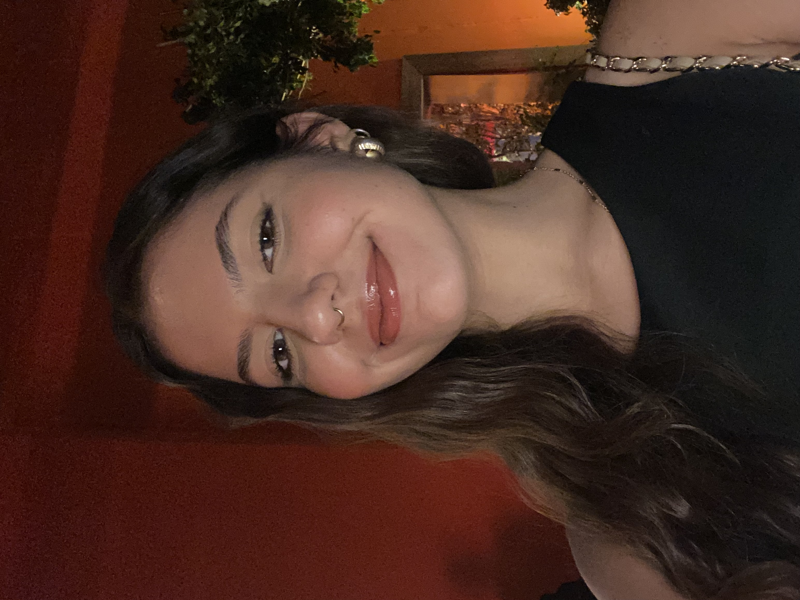
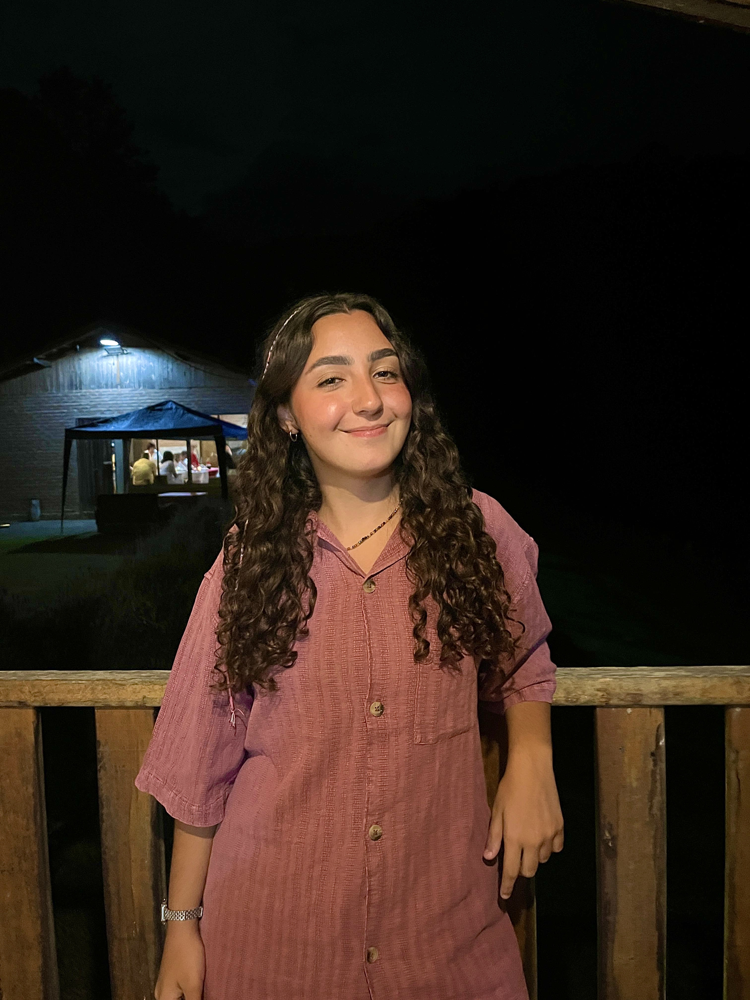
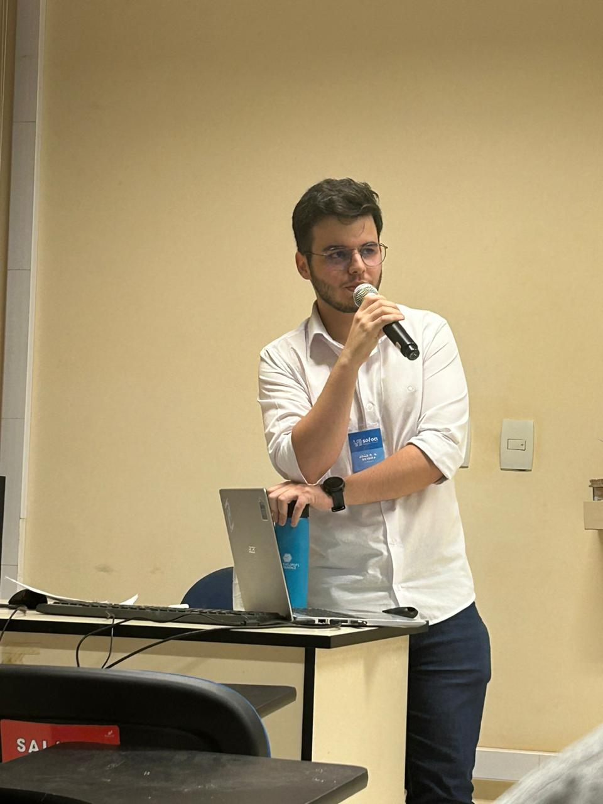
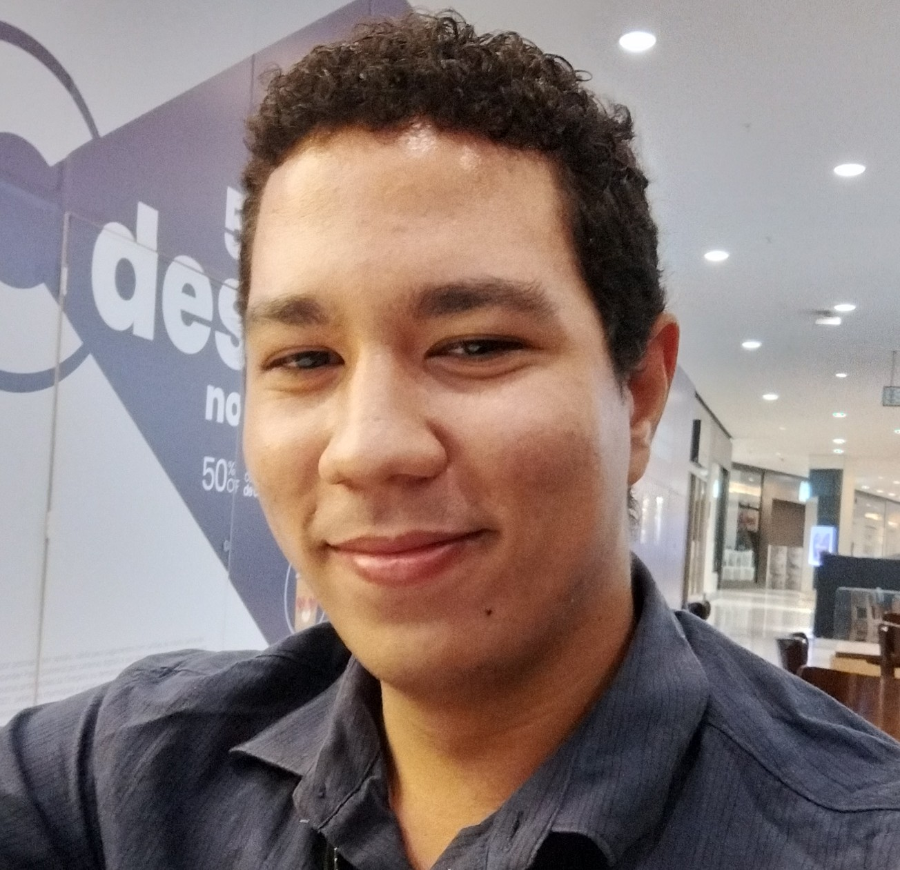
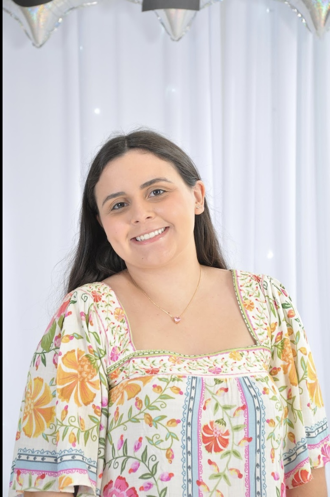
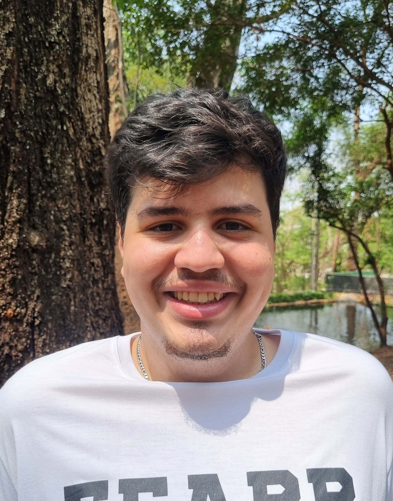

## Sobre o projeto

Conheça a equipe por trás das análises e publicações deste semestre. Nosso projeto faz parte das **Atividades Extensionistas Currículares (AEX)**, o que significa que nosso time é dinâmico e rotativo.

A cada novo ciclo, novos estudantes assumem o desafio de levar o conhecimento acadêmico para a sociedade. Estes são os colaboradores que compõem o projeto no período atual:

------------------------------------------------------------------------

### Nossa equipe 2025/2 e 2026/1

::::::::::::::: grid
::: {.g-col-12 .g-col-md-4}
##### **Anna Livya Queiroz**

{width="150"}
:::

::: {.g-col-12 .g-col-md-4}
##### **Bruna Agostini**

{width="150"}
:::

::: {.g-col-12 .g-col-md-4}
##### **Caroline Lhais Oliveira**

{width="150"}
:::

::: {.g-col-12 .g-col-md-4}
##### **Gabriel**

{width="150"}
:::

::: {.g-col-12 .g-col-md-4}
##### **Giuliana Sigilló**

{width="150"}
:::

::: {.g-col-12 .g-col-md-4}
##### **Gustavo Lima Moraes**

{width="150"}
:::

::: {.g-col-12 .g-col-md-4}
##### **João Gabriel**

{width="150"}
:::

::: {.g-col-12 .g-col-md-4}
##### **Jonathan Cunha**

{width="150"}
:::

::: {.g-col-12 .g-col-md-4}
##### **Leticia Brito**

{width="150"}
:::

::: {.g-col-12 .g-col-md-4}
##### **Manuela Marangoni Jampani**

{width="150"}
:::

::: {.g-col-12 .g-col-md-4}
##### **Matheus de Souza Teixeira**

{width="150"}
:::

::: {.g-col-12 .g-col-md-4}
##### **Paula Leandra**

{width="150"}
:::
:::::::::::::::
