## Sobre o projeto

Conheça a equipe por trás das análises e publicações deste semestre. Nosso projeto faz parte das **Atividades Extensionistas Currículares (AEX)**, o que significa que nosso time é dinâmico e rotativo.

A cada novo ciclo, novos estudantes assumem o desafio de levar o conhecimento acadêmico para a sociedade. Estes são os colaboradores que compõem o projeto no período atual:

------------------------------------------------------------------------

### Turma 1 - Segundo Semestre 2025

::::::::::::::: grid
::: {.g-col-12 .g-col-md-4}
##### **Anna Livya Queiroz**

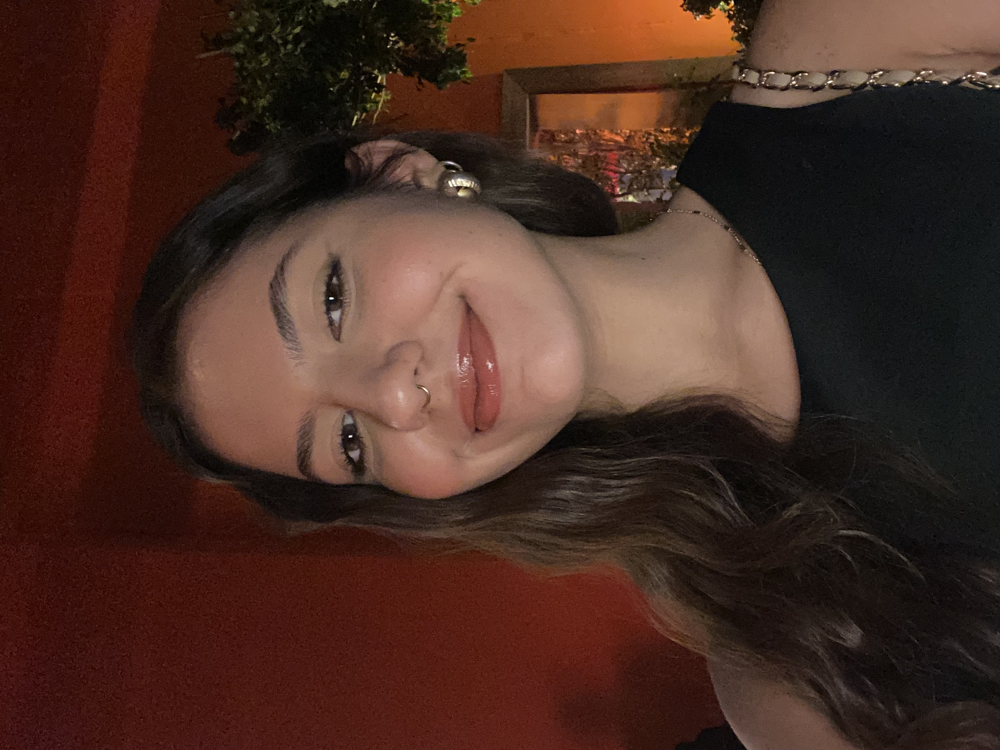{width="150"}
:::

::: {.g-col-12 .g-col-md-4}
##### **Bruna Agostini**

{width="150"}
:::

::: {.g-col-12 .g-col-md-4}
##### **Caroline Lhais Oliveira**

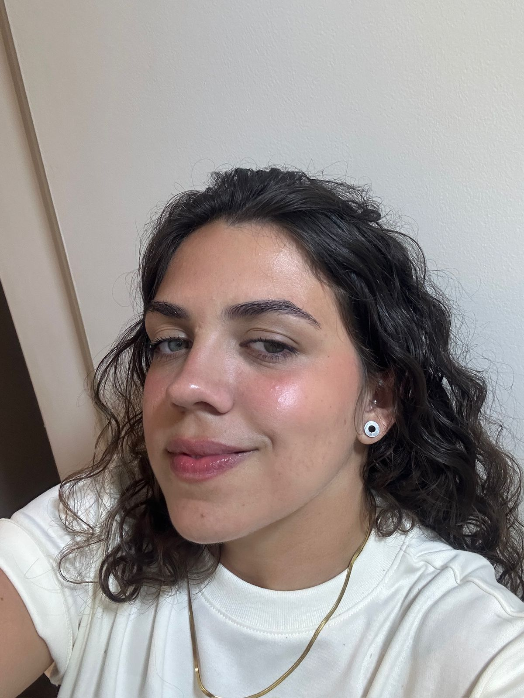{width="150"}
:::

::: {.g-col-12 .g-col-md-4}
##### **Gabriel**

{width="150"}
:::

::: {.g-col-12 .g-col-md-4}
##### **Giuliana Sigilló**

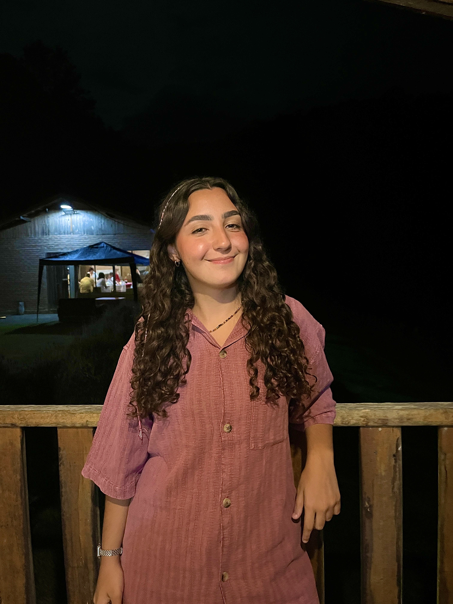{width="150"}
:::

::: {.g-col-12 .g-col-md-4}
##### **Gustavo Lima Moraes**

{width="150"}
:::

::: {.g-col-12 .g-col-md-4}
##### **João Gabriel**

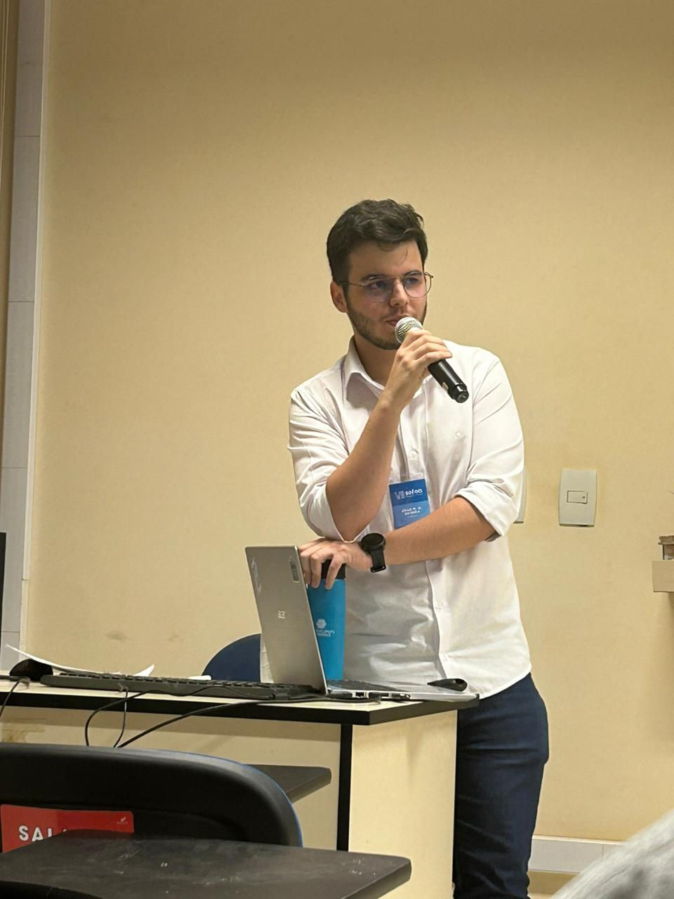{width="150"}
:::

::: {.g-col-12 .g-col-md-4}
##### **Jonathan Cunha**

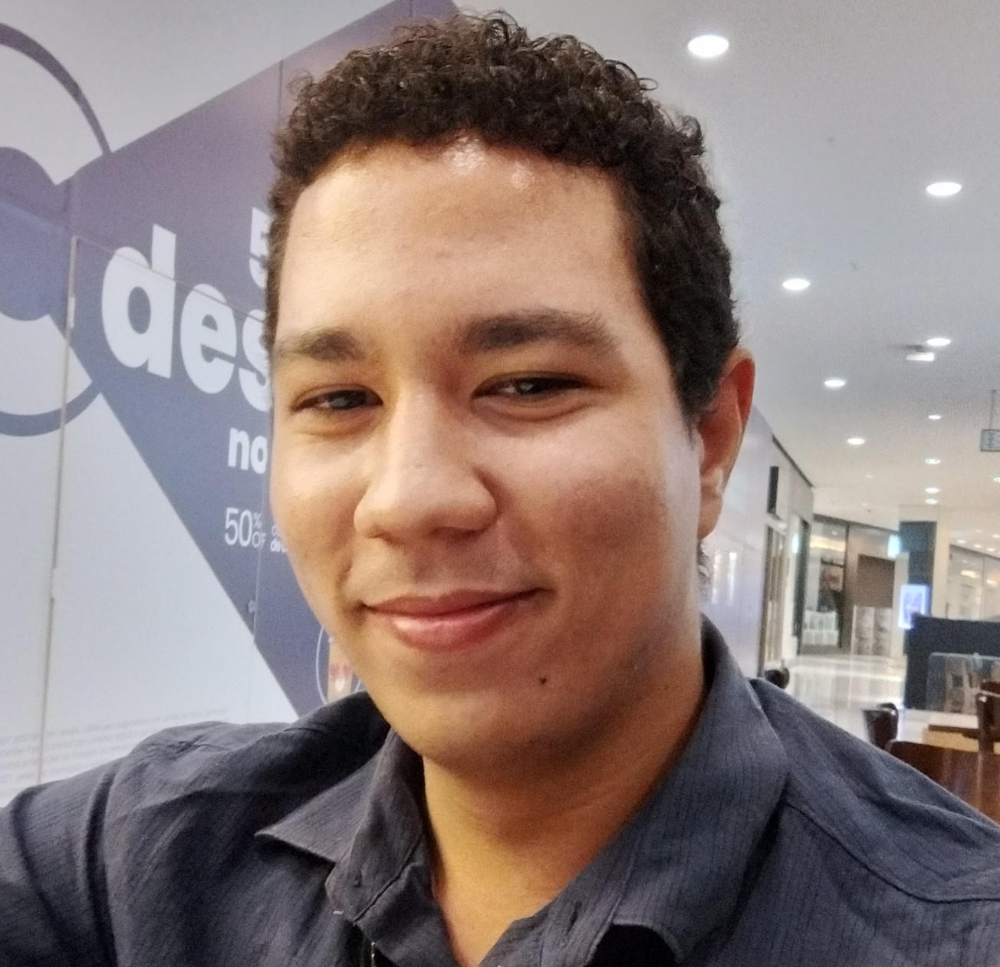{width="150"}
:::

::: {.g-col-12 .g-col-md-4}
##### **Leticia Brito**

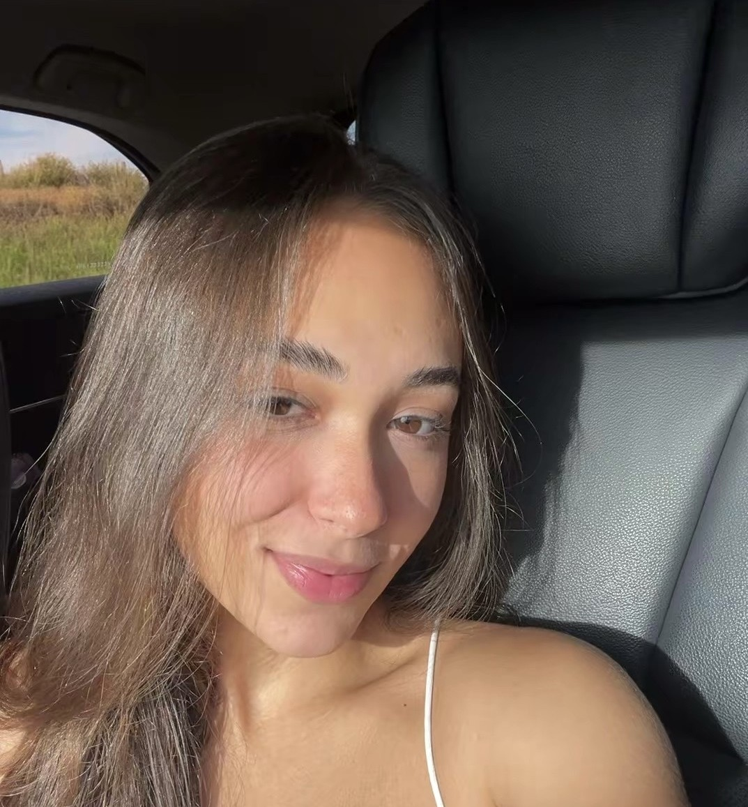{width="150"}
:::

::: {.g-col-12 .g-col-md-4}
##### **Manuela Marangoni Jampani**

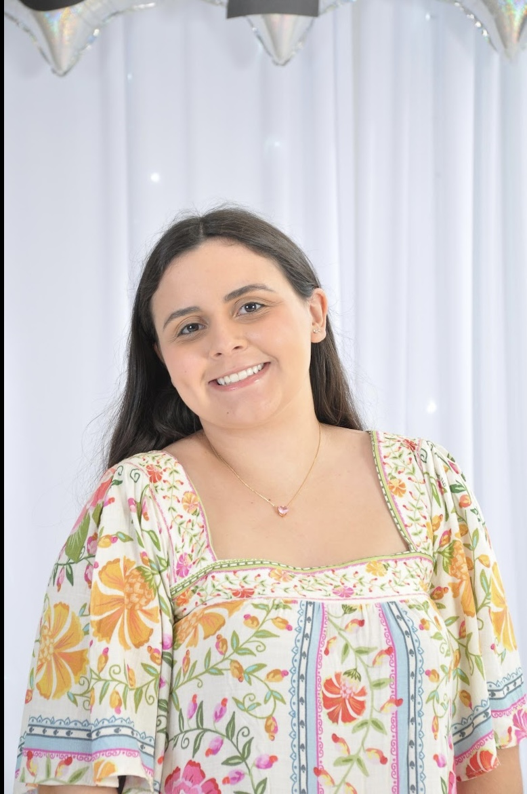{width="150"}
:::

::: {.g-col-12 .g-col-md-4}
##### **Matheus de Souza Teixeira**

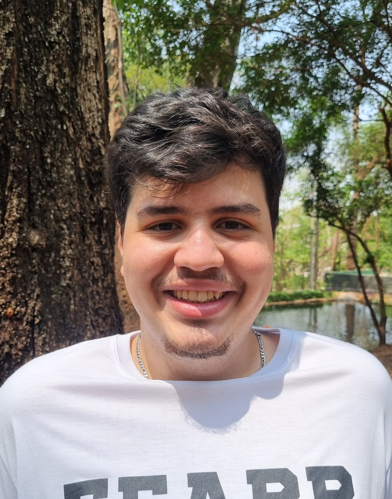{width="150"}
:::

::: {.g-col-12 .g-col-md-4}
##### **Paula Leandra**

{width="150"}
:::
:::::::::::::::

------------------------------------------------------------------------

### Turma 2 - Primeiro Semestre 2026

#### Professora Responsável

::::::::::::::: grid
::: {.g-col-12 .g-col-md-4}
##### **Roseli Basso-Silva**

{width="150"}

Professora de economia, economista de formação, propôs esta Atividade de Extensão "AEX- Tá, mas e a economia?" a partir da iniciativa da estudante Carol Lhais para, juntas e juntos, contribuirmos para o debate econômico no país, para além dos muros da USP.
:::
:::::::::::::::

#### Equipe Produção

::::::::::::::: grid
::: {.g-col-12 .g-col-md-4}
##### **Sofia de Almeida Rodrigues**

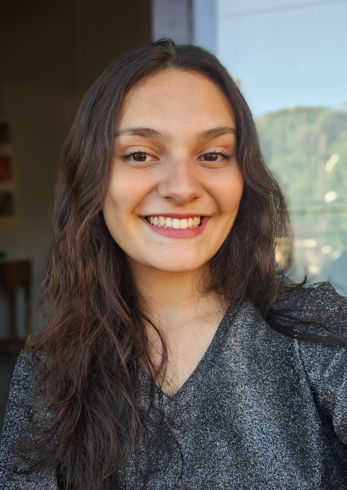{width="150"}

Estudante de economia na FEARP-USP, com interesse em macroeconomia e finanças corporativas, e afinidade com análises que articulam dados e impactos sociais, integrando a equipe de produção da Newsletter.
:::

::: {.g-col-12 .g-col-md-4}
##### **Giovana Alves Paiva**

{width="150"}

Estudante de economia na FEARP-USP, com interesse na dimensão social da economia e em políticas públicas. Se interessa por temas ligados à desigualdade e ao acesso a oportunidades, e integra a equipe de produção da Newsletter.
:::

::: {.g-col-12 .g-col-md-4}
##### **Luiz Henrique Braga Scorzafave**

{width="150"}

Estudante de economia na FEARP-USP, com interesse na área da economia política e políticas públicas, e integra a equipe de produção da Newsletter.
:::

::: {.g-col-12 .g-col-md-4}
##### **Pedro Konstantino Freire Voltezou**

{width="150"}

Estudante de economia na FEARP-USP, com interesse nas áreas de macroeconomia, história econômica, economia política e finanças. Integra a equipe de produção da Newsletter.
:::

::: {.g-col-12 .g-col-md-4}
##### **Arthur Coelho Oliveira**

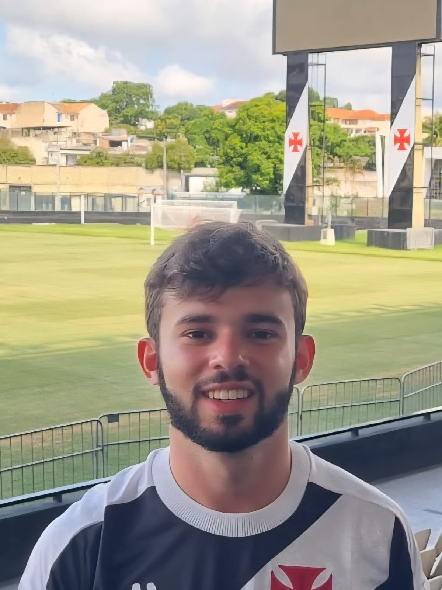{width="150"}

Estudante de economia na FEARP-USP, com interesse nas áreas de macroeconomia, economia política e finanças corporativas, e integra a equipe de produção da Newsletter.
:::

::: {.g-col-12 .g-col-md-4}
##### **Maria Carolina Dias Lobato**

{width="150"}

Estudante de economia na FEA-RP, com interesse nas áreas de macroeconomia, políticas públicas e economia internacional, e integra a equipe de produção da Newsletter.
:::

::: {.g-col-12 .g-col-md-4}
##### **Beatriz Poncio**

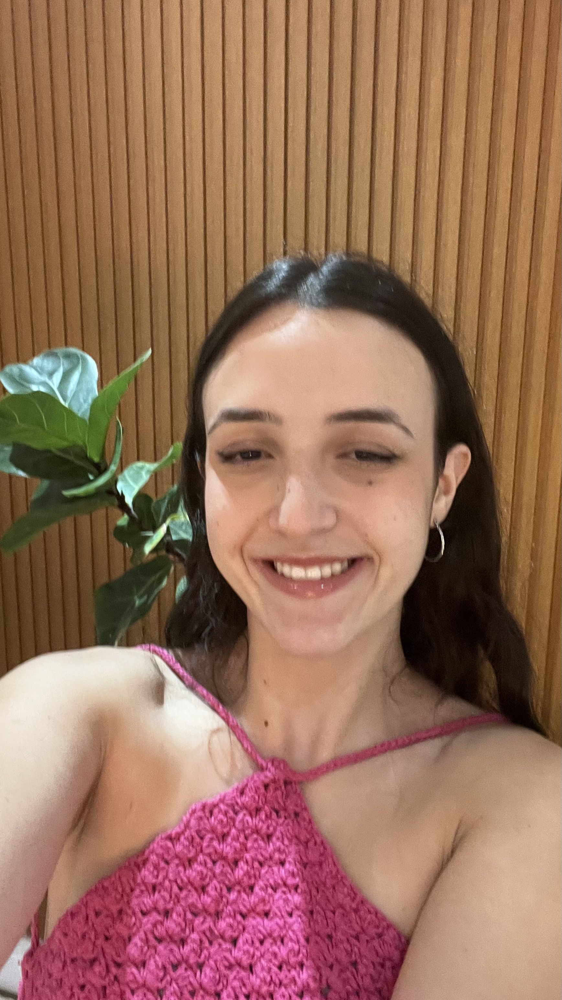{width="150"}

Estudante de economia na FEA-RP, com interesse nas áreas de macroeconomia, economia política e economia internacional, e integra a equipe de produção da newsletter.
:::

::: {.g-col-12 .g-col-md-4}
##### **Rafael Sanches**

{width="150"}

Estudante de Finanças e negócios na FEA-RP, com interesse nas áreas de governança corporativa, macroeconomia e finanças, e integra a equipe de produção da newsletter.
:::
:::::::::::::::

#### Equipe Comunicação e Edição

::::::::::::::: grid
::: {.g-col-12 .g-col-md-4}
##### **Isabella Gargano**

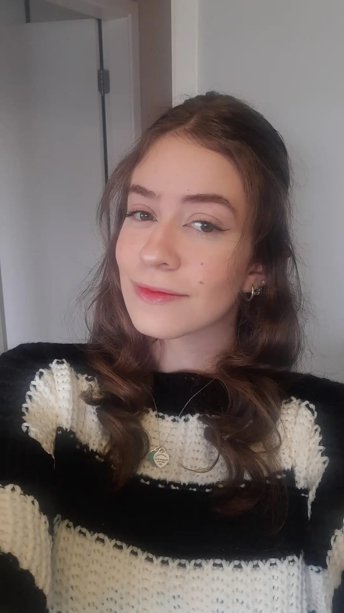{width="150"}

Estudante de jornalismo na Escola de Comunicação e Artes da USP, com afinidade com jornalismo econômico e político internacional, faz parte da equipe de comunicação e edição da Newsletter.
:::

::: {.g-col-12 .g-col-md-4}
##### **Thaís Ferreira Cruz**

{width="150"}

Estudante de química com habilitação em forense na Faculdade de Filosofia, Ciências e Letras de Ribeirão Preto - USP, com afinidade na área de toxicologia bioquímica e integra a equipe de comunicação e edição da Newsletter.
:::

::: {.g-col-12 .g-col-md-4}
##### **Samuel Rubens**

{width="150"}

Estudante de Ciência da Computação na USP-ICMC, atuou como engenheiro de software por 5 anos e atualmente está empreendendo com a Rubrion.
:::

::: {.g-col-12 .g-col-md-4}
##### **Ryan**

{width="150"}

Estudante de administração na FEARP-USP, com interesse na área de marketing. Atua como estagiário na Assessoria de Comunicação da faculdade e integra a equipe de comunicação e edição da Newsletter.
:::
:::::::::::::::